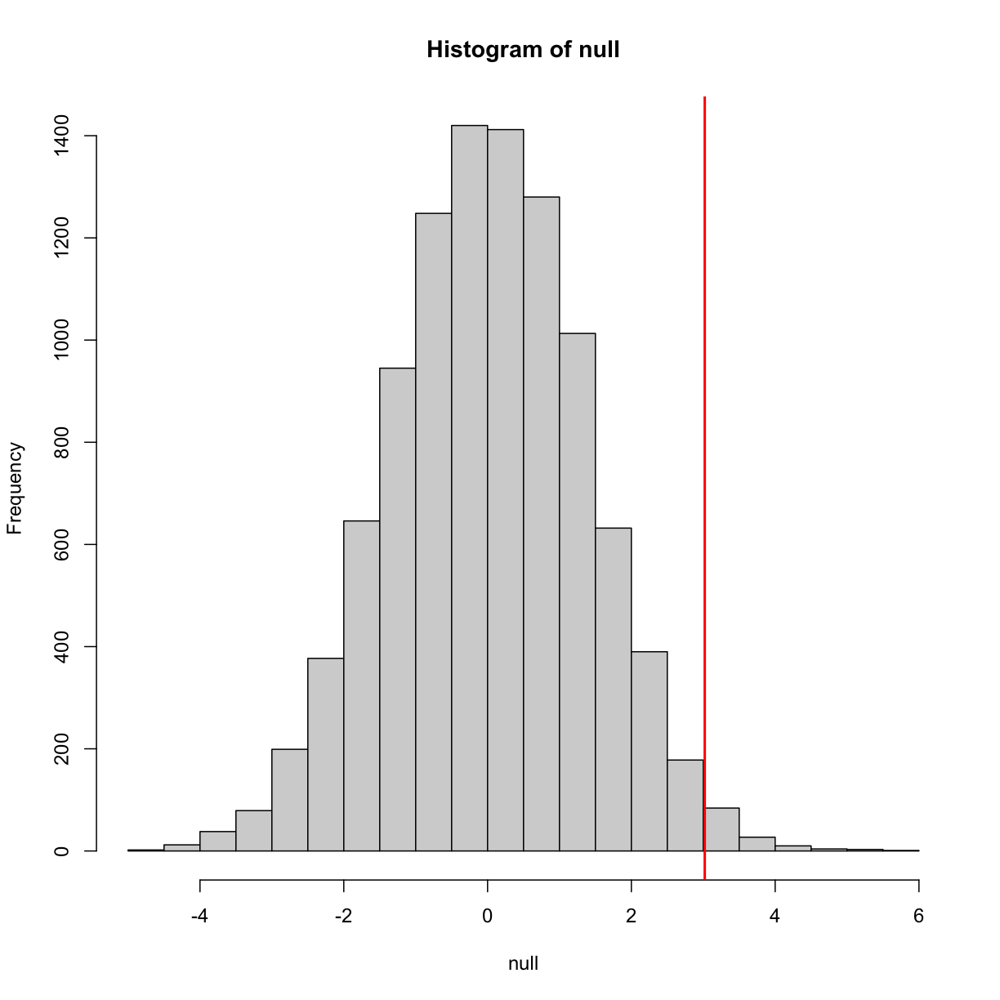

---
# Please do not edit this file directly; it is auto generated.
# Instead, please edit 02-inference-rv-dists.md in _episodes_rmd/
title: "Inference"
teaching: 0
exercises: 0
questions:
- "What does inference mean?"
- "Why do we need p-values and confidence intervals?"
- "What is a random variable?"
- "What exactly is a distribution?"
objectives:
- "Describe the statistical concepts underlying p-values and confidence intervals."
- "Explain random variables and null distributions using R programming."
- "Compute p-values and confidence intervals using R programming."
keypoints:
- "."
- "."
- "."
- "."
source: Rmd
---

## Introduction 

This chapter introduces the statistical concepts necessary to understand 
p-values and confidence intervals. These terms are ubiquitous in the life 
science literature. Let's use 
[this paper](http://diabetes.diabetesjournals.org/content/53/suppl_3/S215.full) 
as an example. 

Note that the abstract has this statement: 

> "Body weight was higher in mice fed the high-fat diet already after the 
first week, due to higher dietary intake in combination with lower metabolic 
efficiency." 

To support this claim they provide the following in the results section:

> "Already during the first week after introduction of high-fat diet, body 
weight increased significantly more in the high-fat diet-fed mice (+ 1.6 &plusmn; 
0.1 g) than in the normal diet-fed mice (+ 0.2 &plusmn; 0.1 g; P < 0.001)."

What does P < 0.001 mean? What are the &plusmn; included?
We will learn what this means and learn to compute these values in
R. The first step is to understand random variables. To do
this, we will use data from a mouse database (provided by Karen
Svenson via Gary Churchill and Dan Gatti and partially funded by P50
GM070683). We will import the data into R and explain random variables
and null distributions using R programming. See [Setup]("https://smcclatchy.github.io/statistical-inference-for-biology/setup/") to import the data.

#### Our first look at data

We are interested in determining if following a given diet makes mice
heavier after several weeks. This data was produced by ordering 24
mice from The Jackson Lab and randomly assigning either chow or high
fat (hf) diet. After several weeks, the scientists weighed each mouse
and obtained this data (`head` just shows us the first 6 rows):

~~~
fWeights <- read.csv("../data/femaleMiceWeights.csv")
head(fWeights) 
~~~
{: .language-r}

~~~
  Diet Bodyweight
1 chow      21.51
2 chow      28.14
3 chow      24.04
4 chow      23.45
5 chow      23.68
6 chow      19.79
~~~
{: .output}

So are the hf mice heavier? Mouse 24 at 20.73 grams is one of the
lightest mice, while Mouse 21 at 34.02 grams is one of the heaviest. Both are on
the hf diet. Just from looking at the data, we see there is
*variability*. Claims such as the one above usually refer to the
averages. So let's look at the average of each group: 

~~~
control <- filter(fWeights, Diet=="chow") %>%
  select(Bodyweight) %>% 
  unlist
treatment <- filter(fWeights, Diet=="hf") %>%
  select(Bodyweight) %>% 
  unlist
print( mean(treatment) )
~~~
{: .language-r}

~~~
[1] 26.83417
~~~
{: .output}

~~~
print( mean(control) )
~~~
{: .language-r}

~~~
[1] 23.81333
~~~
{: .output}

~~~
obsdiff <- mean(treatment) - mean(control)
print(obsdiff)
~~~
{: .language-r}

~~~
[1] 3.020833
~~~
{: .output}

So the hf diet mice are about 10% heavier. Are we done? Why do we need p-values and confidence intervals? The reason is that these averages are random variables. They can take many values. 

If we repeat the experiment, we obtain 24 new mice from The Jackson Laboratory and, after randomly assigning them to each diet, we get a different mean. Every time we repeat this experiment, we get a different value. We call this type of quantity a *random variable*. 

## Random Variables

Let's explore random variables further. Imagine that we actually have the weight of all control female mice and can upload them to R. In Statistics, we refer to this as *the population*. These are all the control mice available from which we sampled 24. Note that in practice we do not have access to the population. We have a special dataset that we are using here to illustrate concepts. 

Now let's sample 12 mice three times and see how the average changes.

~~~
population <- read.csv(file = "../data/femaleControlsPopulation.csv")

control <- sample(population$Bodyweight, 12)
mean(control)
~~~
{: .language-r}

~~~
[1] 23.47667
~~~
{: .output}

~~~
control <- sample(population$Bodyweight, 12)
mean(control)
~~~
{: .language-r}

~~~
[1] 25.12583
~~~
{: .output}

~~~
control <- sample(population$Bodyweight, 12)
mean(control)
~~~
{: .language-r}

~~~
[1] 23.72333
~~~
{: .output}

Note how the average varies. We can continue to do this repeatedly and start learning something about the distribution of this random variable.

## The Null Hypothesis

Now let's go back to our average difference of `obsdiff`. As
scientists we need to be skeptics. How do we know that this `obsdiff`
is due to the diet? What happens if we give all 24 mice the same diet? Will
we see a difference this big? Statisticians refer to this scenario as
the *null hypothesis*. The name "null" is used to remind us that we
are acting as skeptics: we give credence to the possibility that there
is no difference.

Because we have access to the population, we can actually observe as
many values as we want of the difference of the averages when the diet
has no effect. We can do this by randomly sampling 24 control mice,
giving them the same diet, and then recording the difference in mean
between two randomly split groups of 12 and 12. Here is this process
written in R code:

~~~
##12 control mice
control <- sample(population$Bodyweight, 12)
##another 12 control mice that we act as if they were not
treatment <- sample(population$Bodyweight, 12)
print(mean(treatment) - mean(control))
~~~
{: .language-r}

~~~
[1] -0.2391667
~~~
{: .output}

Now let's do it 10,000 times. We will use a "for-loop", an operation
that lets us automate this (a simpler approach that, we will learn later, is to use `replicate`).

~~~
n <- 10000
null <- vector("numeric",n)
for (i in 1:n) {
  control <- sample(population$Bodyweight, 12)
  treatment <- sample(population$Bodyweight, 12)
  null[i] <- mean(treatment) - mean(control)
}
~~~
{: .language-r}

The values in `null` form what we call the *null distribution*. We will define this more formally below. By the way, the loop above is a *Monte Carlo* simulation to obtain 10,000 outcomes of the random variable under the null hypothesis. Simulations can be used to check theoretical or analytical results. For more information about Monte Carlo simulations, visit [Data Analysis for the Life Sciences](http://rwdc2.com/files/rafa.pdf).

So what percent of the 10,000 are bigger than `obsdiff`?

~~~
mean(null >= obsdiff)
~~~
{: .language-r}

~~~
[1] 0.0123
~~~
{: .output}

Only a small percent of the 10,000 simulations. As skeptics what do
we conclude? When there is no diet effect, we see a difference as big
as the one we observed only 1.5% of the time. This is what is known as
a p-value, which we will define more formally later in the book. 

## Distributions

We have explained what we mean by *null* in the context of null hypothesis, but what exactly is a distribution?
The simplest way to think of a *distribution* is as a compact description of many numbers. For example, suppose you have measured the heights of all men in a population. Imagine you need to describe these numbers to someone that has no idea what these heights are, such as an alien that has never visited Earth. Suppose all these heights are contained in the following dataset:

~~~
data(father.son, package="UsingR")
x <- father.son$fheight
~~~
{: .language-r}

One approach to summarizing these numbers is to simply list them all out for the alien to see. Here are 10 randomly selected heights of 1,078:

~~~
round(sample(x, 10), 1)
~~~
{: .language-r}

~~~
 [1] 67.7 72.5 64.7 62.7 66.1 67.5 68.2 61.8 69.7 71.2
~~~
{: .output}

#### Cumulative Distribution Function

Scanning through these numbers, we start to get a rough idea of what the entire list looks like, but it is certainly inefficient. We can quickly improve on this approach by defining and visualizing a _distribution_. To define a distribution we compute, for all possible values of <i>a</i>, the proportion of numbers in our list that are below <i>a</i>. We use the following notation:

This is called the cumulative distribution function (CDF). When the CDF is derived from data, as opposed to theoretically, we also call it the empirical CDF (ECDF). The ECDF for the height data looks like this:

#### Histograms

Although the empirical CDF concept is widely discussed in statistics textbooks, the plot is actually not very popular in practice. The reason is that histograms give us the same information and are easier to interpret. Histograms show us the proportion of values in intervals: 

Plotting these heights as bars is what we call a _histogram_. It is a
more useful plot because we are usually more interested in intervals,
such and such percent are between 70 inches and 71 inches, etc.,
rather than the percent less than a particular height. Here is a histogram 
of heights: 

~~~
hist(x, xlab="Height (in inches)", main="Adult men heights")
~~~
{: .language-r}

Showing this plot to the alien is much more informative than showing numbers. With this simple plot, we can approximate the number of individuals in any given interval. For example, there are about 70 individuals over six feet (72 inches) tall. 

## Probability Distribution

Summarizing lists of numbers is one powerful use of distribution. An
even more important use is describing the possible outcomes of a
random variable. Unlike a fixed list of numbers, we don't actually observe all possible outcomes of random variables, so instead of describing proportions, we describe probabilities. For instance, if we pick a random height from our list,
then the probability of it falling between <i>a</i> and <i>b</i> is denoted with: 

Note that the <i>X</i> is now capitalized to distinguish it as a random
variable and that the equation above defines the probability
distribution of the random variable. Knowing this distribution is
incredibly useful in science. For example, in the case above, if we
know the distribution of the difference in mean of mouse weights
when the null hypothesis is true, referred to as the _null distribution_, we can
compute the probability of observing a value as large as we did,
referred to as a _p-value_. In a previous section we ran what is
called a _Monte Carlo_ simulation (we will provide more details on
Monte Carlo simulation in a later section) and we obtained 10,000
outcomes of the random variable under the null hypothesis.

The observed values will amount to a histogram. From a histogram of the
`null` vector we calculated earlier, we can see that values as large
as `obsdiff` are relatively rare: 

~~~
hist(null, freq=TRUE)
abline(v=obsdiff, col="red", lwd=2)
~~~
{: .language-r}

An important point to keep in mind here is that while we defined Pr<i>(a)</i> by counting cases, we will learn that, in some circumstances, mathematics gives us formulas for Pr<i>(a)</i> that save us the trouble of computing them as we did here. One example of this powerful approach uses the normal distribution approximation.

## Normal Distribution

The probability distribution we see above approximates one that is very common in nature: the bell curve, also known as the normal distribution or Gaussian distribution. When the histogram of a list of numbers approximates the normal distribution, we can use a convenient mathematical formula to approximate the proportion of values or outcomes in any given interval:

While the formula may look intimidating, don't worry, you will never
actually have to type it out, as it is stored in a more convenient
form (as `pnorm` in R which sets *a* to -&infin;, and takes *b* as an argument). 

Here &mu; and &sigma; are referred to as the mean and the standard
deviation of the population (we explain these in more detail in
another section). If this *normal approximation* holds for our list, then the
population mean and variance of our list can be used in the formula
above. An example of this would be when we noted above that only 1.5%
of values on the null distribution were above `obsdiff`. We can
compute the proportion of values below a value `x` with
`pnorm(x, mu, sigma)` without knowing all the values. The normal
approximation works very well here: 

~~~
1 - pnorm(obsdiff, mean(null), sd(null)) 
~~~
{: .language-r}

~~~
[1] 0.01311009
~~~
{: .output}

Later, we will learn that there is a mathematical explanation for this. A very useful characteristic of this approximation is that one only needs to know &mu; and &sigma; to describe the entire distribution. From this, we can compute the proportion of values in any interval. 

Refer to the histogram of null values above. The code we just ran represents everything to the right of the vertical red line, or 1 minus everything to the left. Try running this code without the `1 - ` to understand this better. 

~~~
pnorm(obsdiff, mean(null), sd(null)) 
~~~
{: .language-r}

~~~
[1] 0.9868899
~~~
{: .output}

This value represents everything to the left of the vertical red line in the null histogram above. 

#### Summary

So computing a p-value for the difference in diet for the mice was
pretty easy, right? But why are we not done? To make the calculation,
we did the equivalent of buying all the mice available from The
Jackson Laboratory and performing our experiment repeatedly to define
the null distribution. Yet this is not something we can do in
practice. Statistical Inference is the mathematical theory that
permits you to approximate this with only the data from your sample,
i.e. the original 24 mice. We will focus on this in the following
sections.

#### Setting the random seed

Before we continue, we briefly explain the following important line of
code:

~~~
set.seed(1) 
~~~
{: .language-r}

Throughout this book, we use random number generators. This implies that many of the results presented can actually change by chance, including the correct answer to problems. One way to ensure that results do not change is by setting R's random number generation seed. For more on the topic please read the help file:

~~~
?set.seed
~~~
{: .language-r}

Even better is to review an example. R has a built-in vector of characters called `LETTERS` that contains upper case letters of the Roman alphabet. We can take a sample of 5 letters with the following code, which when repeated will give a different set of 5 letters each times.

~~~
LETTERS
~~~
{: .language-r}

~~~
 [1] "A" "B" "C" "D" "E" "F" "G" "H" "I" "J" "K" "L" "M" "N" "O" "P" "Q" "R" "S"
[20] "T" "U" "V" "W" "X" "Y" "Z"
~~~
{: .output}

~~~
sample(LETTERS, 5)
~~~
{: .language-r}

~~~
[1] "Y" "D" "G" "A" "B"
~~~
{: .output}

~~~
sample(LETTERS, 5)
~~~
{: .language-r}

~~~
[1] "W" "K" "N" "R" "S"
~~~
{: .output}

~~~
sample(LETTERS, 5)
~~~
{: .language-r}

~~~
[1] "A" "U" "Y" "J" "V"
~~~
{: .output}

If we set a seed, we will get the same sample of letters each time.

~~~
set.seed(1)
sample(LETTERS, 5)
~~~
{: .language-r}

~~~
[1] "Y" "D" "G" "A" "B"
~~~
{: .output}

~~~
set.seed(1)
sample(LETTERS, 5)
~~~
{: .language-r}

~~~
[1] "Y" "D" "G" "A" "B"
~~~
{: .output}

~~~
set.seed(1)
sample(LETTERS, 5)
~~~
{: .language-r}

~~~
[1] "Y" "D" "G" "A" "B"
~~~
{: .output}

When we set a seed we ensure that we get the same results from random number generation, which is used in sampling with `sample`.

For the following exercises, we will be using the female controls population dataset that we read into a variable called `population`. Here `population` represents the weights for the entire population of female mice. To remind ourselves about this data set, run the following:

~~~
str(population)
~~~
{: .language-r}

~~~
'data.frame':	225 obs. of  1 variable:
 $ Bodyweight: num  27 24.8 27 28.1 23.6 ...
~~~
{: .output}

~~~
head(population)
~~~
{: .language-r}

~~~
  Bodyweight
1      27.03
2      24.80
3      27.02
4      28.07
5      23.55
6      22.72
~~~
{: .output}

~~~
summary(population)
~~~
{: .language-r}

~~~
   Bodyweight   
 Min.   :15.51  
 1st Qu.:21.51  
 Median :23.54  
 Mean   :23.89  
 3rd Qu.:26.08  
 Max.   :36.84  
~~~
{: .output}

  
> ## Exercise 1
> 1. What is the average of these weights?  
> 2. After setting the seed at 1, (`set.seed(1)`) take a random sample of size 5.   
> What is the absolute value (`abs()`) of the difference between the 
> average of the sample and the average of all the values?  
> 3. After setting the seed at 5, `set.seed(5)` take a random sample of size 5. What is the absolute 
> value of the difference between the average of the sample and the average of all the values?  
> 4. Why are the answers from 2 and 3 different?   
> A) Because we made a coding mistake.  
> B) Because the average of the population weights is random.  
> C) Because the average of the samples is a random variable.  
> D) All of the above.  
>
> > ## Solution to Exercise 1  
> > 1. `mean(population$Bodyweight)` 
> >  
> > 2. `set.seed(1)`  
> > `meanOfSample1 <- mean(sample(population$Bodyweight, 5))`  
> > `abs(meanOfSample1 - mean(population$Bodyweight))` 
> >  
> > 3. `set.seed(5)`  
> > `meanOfSample2 <- mean(sample(population$Bodyweight, 5))`  
> > `abs(meanOfSample2 - mean(population$Bodyweight))`  
> >  
> >  4. C) Because the average of the samples is a random variable.  
> {: .solution}
{: .challenge}

> ## Exercise 2
> 1. Set the seed at 1, then using a for-loop take a random sample of 5 mice 1,000 times. 
> Save these averages. What percent of these 1,000 averages are more than 1 ounce away from the
> average of the population?  
> 2. We are now going to increase the number of times we redo the sample from 1,000 to 10,000.  
> Set the seed at 1, then using a for-loop take a random sample of 5 mice 10,000 times.   
> Save these averages. What percent of these 10,000 averages are more than 1 ounce away from
> the average of the population?  
> 3. Note that the answers to the previous two questions barely changed. This is expected.  
> The way we think about the random value distributions is as the distribution of the list of values
> obtained if we repeated the experiment an infinite number of times. On a computer, we can’t perform
> an infinite number of iterations so instead, for our examples, we consider 1,000 to be large enough,
> thus 10,000 is as well. Now if instead we change the sample size, then we change the random variable
> and thus its distribution.  
> Set the seed at 1, then using a for-loop take a random sample of 50 mice 1,000 times. Save these
> averages. What percent of these 1,000 averages are more than 1 ounce away from the average of the population?  
>
> > ## Solution to Exercise 2
> > 1. `set.seed(1)`
> >  `n <- 1000`
> > `meanSampleOf5 <- vector("numeric",n)`
> > `for (i in 1:n) {`
> > `  meanSampleOf5[i] <- mean(sample(population$Bodyweight, 5)`  
> > `}

> > 2.   
> > `meanOfSample1 <- mean(sample(population$Bodyweight, 5))`  
> > `abs(meanOfSample1 - mean(population$Bodyweight))` 
> >  
> > 3. `set.seed(5)`  
> > `meanOfSample2 <- mean(sample(population$Bodyweight, 5))`  
> > `abs(meanOfSample2 - mean(population$Bodyweight))`  
> >  
> >  4. C) Because the average of the samples is a random variable.  
> {: .solution}
{: .challenge}

> ## Exercise 3
> Use a histogram to “look” at the distribution of averages we get with a sample size of 5 
> and a sample size of 50. How would you say they differ?
> A) They are actually the same.
> B) They both look roughly normal, but with a sample size of 50 the spread is smaller.
> C) They both look roughly normal, but with a sample size of 50 the spread is larger.
> D) The second distribution does not look normal at all.
>
> > ## Solution to Exercise 3
> {: .solution}
{: .challenge}

> ## Exercise 4
> For the last set of averages, the ones obtained from a sample size of 50, what percent are 
> between 23 and 25?
> Now ask the same question of a normal distribution with average 23.9 and standard deviation 0.43.
> The answer to the previous two were very similar. This is because we can approximate the 
> distribution of the sample average with a normal distribution. 
> We will learn more about the reason for this next.
>
> > ## Solution to Exercise 4
> {: .solution}
{: .challenge}

