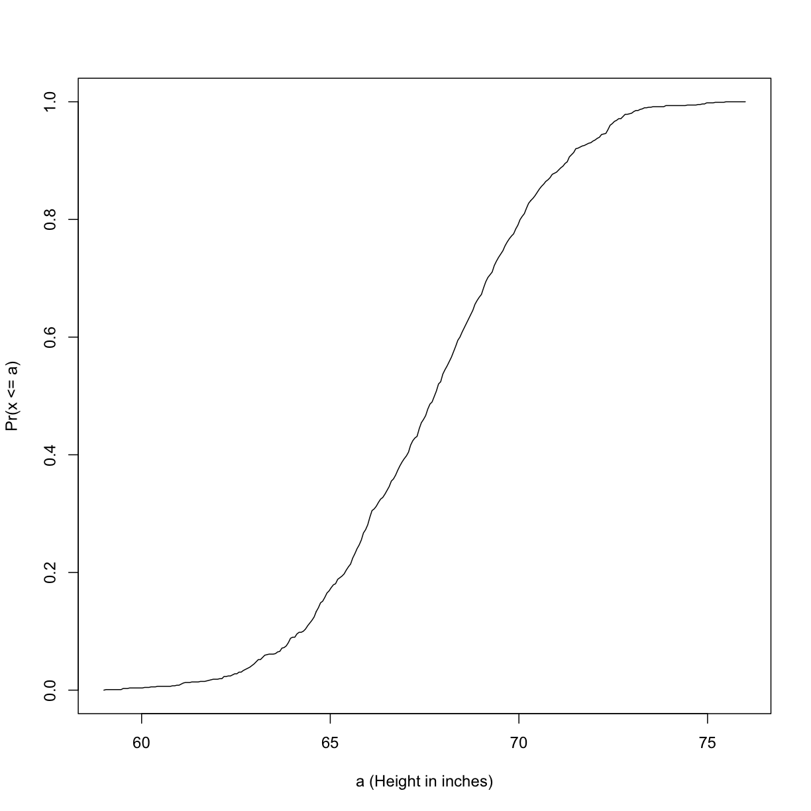
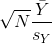
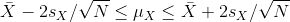

---
# Please do not edit this file directly; it is auto generated.
# Instead, please edit 02-inference.md in _episodes_rmd/
title: "Inference"
teaching: 0
exercises: 0
questions:
- "what does inference mean?"
- "?"
- "?"
objectives:
- ""
- ""
- ""
- ""
- ""
- ""
- ""
keypoints:
- "."
- "."
- "."
- "."
source: Rmd
---

## Introduction 

This chapter introduces the statistical concepts necessary to understand 
p-values and confidence intervals. These terms are ubiquitous in the life 
science literature. Let's use 
[this paper](http://diabetes.diabetesjournals.org/content/53/suppl_3/S215.full) 
as an example. 

Note that the abstract has this statement: 

> "Body weight was higher in mice fed the high-fat diet already after the 
first week, due to higher dietary intake in combination with lower metabolic 
efficiency." 

To support this claim they provide the following in the results section:

> "Already during the first week after introduction of high-fat diet, body 
weight increased significantly more in the high-fat diet-fed mice ($+$ 1.6 $\pm$ 
0.1 g) than in the normal diet-fed mice ($+$ 0.2 $\pm$ 0.1 g; P < 0.001)."

What does P < 0.001 mean? What are the $\pm$ included?
We will learn what this means and learn to compute these values in
R. The first step is to understand random variables. To do
this, we will use data from a mouse database (provided by Karen
Svenson via Gary Churchill and Dan Gatti and partially funded by P50
GM070683). We will import the data into R and explain random variables
and null distributions using R programming. See [Setup]("../setup.md") to import the data.

#### Our first look at data

We are interested in determining if following a given diet makes mice
heavier after several weeks. This data was produced by ordering 24
mice from The Jackson Lab and randomly assigning either chow or high
fat (hf) diet. After several weeks, the scientists weighed each mouse
and obtained this data (`head` just shows us the first 6 rows):

~~~
dat <- read_csv("../data/femaleMiceWeights.csv")
~~~
{: .language-r}

~~~
Parsed with column specification:
cols(
  Diet = col_character(),
  Bodyweight = col_double()
)
~~~
{: .output}

~~~
head(dat) 
~~~
{: .language-r}

~~~
# A tibble: 6 x 2
  Diet  Bodyweight
  <chr>      <dbl>
1 chow        21.5
2 chow        28.1
3 chow        24.0
4 chow        23.4
5 chow        23.7
6 chow        19.8
~~~
{: .output}

So are the hf mice heavier? Mouse 24 at 20.73 grams is one of the
lightest mice, while Mouse 21 at 34.02 grams is one of the heaviest. Both are on
the hf diet. Just from looking at the data, we see there is
*variability*. Claims such as the one above usually refer to the
averages. So let's look at the average of each group: 

~~~
control <- filter(dat, Diet=="chow") %>% select(Bodyweight)
treatment <- filter(dat, Diet=="hf") %>% select(Bodyweight)
print( mean(treatment) )
~~~
{: .language-r}

~~~
Warning in mean.default(treatment): argument is not numeric or logical:
returning NA
~~~
{: .error}

~~~
[1] NA
~~~
{: .output}

~~~
print( mean(control) )
~~~
{: .language-r}

~~~
Warning in mean.default(control): argument is not numeric or logical:
returning NA
~~~
{: .error}

~~~
[1] NA
~~~
{: .output}

~~~
obsdiff <- mean(treatment) - mean(control)
~~~
{: .language-r}

~~~
Warning in mean.default(treatment): argument is not numeric or logical:
returning NA
~~~
{: .error}

~~~
Warning in mean.default(control): argument is not numeric or logical:
returning NA
~~~
{: .error}

~~~
print(obsdiff)
~~~
{: .language-r}

~~~
[1] NA
~~~
{: .output}

So the hf diet mice are about 10% heavier. Are we done? Why do we need p-values and confidence intervals? The reason is that these averages are random variables. They can take many values. 

If we repeat the experiment, we obtain 24 new mice from The Jackson Laboratory and, after randomly assigning them to each diet, we get a different mean. Every time we repeat this experiment, we get a different value. We call this type of quantity a *random variable*. 

## Random Variables

Let's explore random variables further. Imagine that we actually have the weight of all control female mice and can upload them to R. In Statistics, we refer to this as *the population*. These are all the control mice available from which we sampled 24. Note that in practice we do not have access to the population. We have a special dataset that we are using here to illustrate concepts. 

Now let's sample 12 mice three times and see how the average changes.

~~~
population <- read_csv(file = "../data/femaleControlsPopulation.csv")
~~~
{: .language-r}

~~~
Parsed with column specification:
cols(
  Bodyweight = col_double()
)
~~~
{: .output}

~~~
control <- sample(population$Bodyweight, 12)
mean(control$Bodyweight)
~~~
{: .language-r}

~~~
Error in control$Bodyweight: $ operator is invalid for atomic vectors
~~~
{: .error}

~~~
control <- sample(population$Bodyweight, 12)
mean(control$Bodyweight)
~~~
{: .language-r}

~~~
Error in control$Bodyweight: $ operator is invalid for atomic vectors
~~~
{: .error}

~~~
control <- sample(population$Bodyweight, 12)
mean(control$Bodyweight)
~~~
{: .language-r}

~~~
Error in control$Bodyweight: $ operator is invalid for atomic vectors
~~~
{: .error}

Note how the average varies. We can continue to do this repeatedly and start learning something about the distribution of this random variable.

## The Null Hypothesis

Now let's go back to our average difference of `obsdiff`. As
scientists we need to be skeptics. How do we know that this `obsdiff`
is due to the diet? What happens if we give all 24 mice the same diet? Will
we see a difference this big? Statisticians refer to this scenario as
the *null hypothesis*. The name "null" is used to remind us that we
are acting as skeptics: we give credence to the possibility that there
is no difference.

Because we have access to the population, we can actually observe as
many values as we want of the difference of the averages when the diet
has no effect. We can do this by randomly sampling 24 control mice,
giving them the same diet, and then recording the difference in mean
between two randomly split groups of 12 and 12. Here is this process
written in R code:

~~~
##12 control mice
control <- sample(population$Bodyweight, 12)
##another 12 control mice that we act as if they were not
treatment <- sample(population$Bodyweight, 12)
print(mean(treatment) - mean(control))
~~~
{: .language-r}

~~~
[1] -0.2391667
~~~
{: .output}

Now let's do it 10,000 times. We will use a "for-loop", an operation
that lets us automate this (a simpler approach that, we will learn later, is to use `replicate`).

~~~
n <- 10000
null <- vector("numeric",n)
for (i in 1:n) {
  control <- sample(population$Bodyweight, 12)
  treatment <- sample(population$Bodyweight, 12)
  null[i] <- mean(treatment) - mean(control)
}
~~~
{: .language-r}

The values in `null` form what we call the *null distribution*. We will define this more formally below.

So what percent of the 10,000 are bigger than `obsdiff`?

~~~
mean(null >= obsdiff)
~~~
{: .language-r}

~~~
[1] NA
~~~
{: .output}

Only a small percent of the 10,000 simulations. As skeptics what do
we conclude? When there is no diet effect, we see a difference as big
as the one we observed only 1.5% of the time. This is what is known as
a p-value, which we will define more formally later in the book. 

## Distributions

We have explained what we mean by *null* in the context of null hypothesis, but what exactly is a distribution?
The simplest way to think of a *distribution* is as a compact description of many numbers. For example, suppose you have measured the heights of all men in a population. Imagine you need to describe these numbers to someone that has no idea what these heights are, such as an alien that has never visited Earth. Suppose all these heights are contained in the following dataset:

~~~
data(father.son, package="UsingR")
x <- father.son$fheight
~~~
{: .language-r}

One approach to summarizing these numbers is to simply list them all out for the alien to see. Here are 10 randomly selected heights of 1,078:

~~~
round(sample(x, 10), 1)
~~~
{: .language-r}

~~~
 [1] 67.7 72.5 64.7 62.7 66.1 67.5 68.2 61.8 69.7 71.2
~~~
{: .output}

#### Cumulative Distribution Function

Scanning through these numbers, we start to get a rough idea of what the entire list looks like, but it is certainly inefficient. We can quickly improve on this approach by defining and visualizing a _distribution_. To define a distribution we compute, for all possible values of $a$, the proportion of numbers in our list that are below $a$. We use the following notation:

This is called the cumulative distribution function (CDF). When the CDF is derived from data, as opposed to theoretically, we also call it the empirical CDF (ECDF). The ECDF for the height data looks like this:

#### Histograms

Although the empirical CDF concept is widely discussed in statistics textbooks, the plot is actually not very popular in practice. The reason is that histograms give us the same information and are easier to interpret. Histograms show us the proportion of values in intervals: 

Plotting these heights as bars is what we call a _histogram_. It is a
more useful plot because we are usually more interested in intervals,
such and such percent are between 70 inches and 71 inches, etc.,
rather than the percent less than a particular height. Here is a histogram 
of heights: 

~~~
hist(x, xlab="Height (in inches)", main="Adult men heights")
~~~
{: .language-r}

Showing this plot to the alien is much more informative than showing numbers. With this simple plot, we can approximate the number of individuals in any given interval. For example, there are about 70 individuals over six feet (72 inches) tall. 

## Probability Distribution

Summarizing lists of numbers is one powerful use of distribution. An
even more important use is describing the possible outcomes of a
random variable. Unlike a fixed list of numbers, we don't actually observe all possible outcomes of random variables, so instead of describing proportions, we describe probabilities. For instance, if we pick a random height from our list,
then the probability of it falling between $a$ and $b$ is denoted with: 

Note that the $X$ is now capitalized to distinguish it as a random
variable and that the equation above defines the probability
distribution of the random variable. Knowing this distribution is
incredibly useful in science. For example, in the case above, if we
know the distribution of the difference in mean of mouse weights
when the null hypothesis is true, referred to as the _null distribution_, we can
compute the probability of observing a value as large as we did,
referred to as a _p-value_. In a previous section we ran what is
called a _Monte Carlo_ simulation (we will provide more details on
Monte Carlo simulation in a later section) and we obtained 10,000
outcomes of the random variable under the null hypothesis.

The observed values will amount to a histogram. From a histogram of the
`null` vector we calculated earlier, we can see that values as large
as `obsdiff` are relatively rare: 

~~~
hist(null, freq=TRUE)
abline(v=obsdiff, col="red", lwd=2)
~~~
{: .language-r}

An important point to keep in mind here is that while we defined $\mbox{Pr}(a)$ by counting cases, we will learn that, in some circumstances, mathematics gives us formulas for $\mbox{Pr}(a)$ that save us the trouble of computing them as we did here. One example of this powerful approach uses the normal distribution approximation.

## Normal Distribution

The probability distribution we see above approximates one that is very common in nature: the bell curve, also known as the normal distribution or Gaussian distribution. When the histogram of a list of numbers approximates the normal distribution, we can use a convenient mathematical formula to approximate the proportion of values or outcomes in any given interval:

While the formula may look intimidating, don't worry, you will never
actually have to type it out, as it is stored in a more convenient
form (as `pnorm` in R which sets *a* to $-\infty$, and takes *b* as an argument). 

Here $\mu$ and $\sigma$ are referred to as the mean and the standard
deviation of the population (we explain these in more detail in
another section). If this *normal approximation* holds for our list, then the
population mean and variance of our list can be used in the formula
above. An example of this would be when we noted above that only 1.5%
of values on the null distribution were above `obsdiff`. We can
compute the proportion of values below a value `x` with
`pnorm(x,mu,sigma)` without knowing all the values. The normal
approximation works very well here: 

~~~
1 - pnorm(obsdiff, mean(null), sd(null)) 
~~~
{: .language-r}

~~~
[1] NA
~~~
{: .output}

Later, we will learn that there is a mathematical explanation for this. A very useful characteristic of this approximation is that one only needs to know $\mu$ and $\sigma$ to describe the entire distribution. From this, we can compute the proportion of values in any interval. 

#### Summary

So computing a p-value for the difference in diet for the mice was
pretty easy, right? But why are we not done? To make the calculation,
we did the equivalent of buying all the mice available from The
Jackson Laboratory and performing our experiment repeatedly to define
the null distribution. Yet this is not something we can do in
practice. Statistical Inference is the mathematical theory that
permits you to approximate this with only the data from your sample,
i.e. the original 24 mice. We will focus on this in the following
sections.

#### Setting the random seed

Before we continue, we briefly explain the following important line of
code:

~~~
set.seed(1) 
~~~
{: .language-r}

Throughout this book, we use random number generators. This implies that many of the results presented can actually change by chance, including the correct answer to problems. One way to ensure that results do not change is by setting R's random number generation seed. For more on the topic please read the help file:

~~~
?set.seed
~~~
{: .language-r}

## Populations and Sample Estimates 
We can never know the true mean or variance of an entire population. Why not? Because we can't feasibly measure every member of a population. We can never know the true mean blood pressure of all mice, for example, even if all are from one strain, because we can't afford to buy them all or even find them all. We can never know the true mean blood pressure of all people on a Western diet, for example, because we can't possible measure the entire population that's on a Western diet. If we could measure all people on a Western diet, we really are interested in the difference in means between people on a Western vs. non high fat high sugar diet because we want to know what effect the diet has on people. If there is no difference in means, we can say that there is no effect of diet. If there is a difference in means, we can say that the diet has an effect. 
The question we are asking is can be expressed as:

Is

[example of normal curves]("https://www.varsitytutors.com/assets/vt-hotmath-legacy/hotmath_help/topics/normal-distribution-of-data/normal-distribution-1.gif")

We also want to know the variance from the mean, so that we have a sense of the spread of measurement around the mean.

In reality we use sample estimates of population parameters. The true population parameters that we are interested in are mean and standard deviation. Here we learn how to taking a sample permits us to answer our questions about differences between groups. This is the essence of statistical inference.

Now that we have introduced the idea of a random variable, a null distribution, and a p-value, we are ready to describe the mathematical theory that permits us to compute p-values in practice. We will also learn about confidence intervals and power calculations.

~~~
pheno <- read_csv(file = "../data/mice_pheno.csv")
~~~
{: .language-r}

~~~
Parsed with column specification:
cols(
  Sex = col_character(),
  Diet = col_character(),
  Bodyweight = col_double()
)
~~~
{: .output}

We can then access the population values and determine, for example, how many we have. Here we compute the size of the control population:

~~~
controlPopulation <- filter(pheno, Sex == "F" & Diet == "chow") %>%
  select(Bodyweight)
length(controlPopulation)
~~~
{: .language-r}

~~~
[1] 1
~~~
{: .output}

We usually denote these values as $x_1,\dots,x_m$. In this case, $m$ is the number computed above. We can do the same for the high fat diet population:

~~~
hfPopulation <- filter(pheno, Sex == "F" & Diet == "hf") %>%  
  select(Bodyweight)
length(hfPopulation)
~~~
{: .language-r}

~~~
[1] 1
~~~
{: .output}

and denote with $y_1,\dots,y_n$.

We can then define summaries of interest for these populations, such as the mean and variance. 

The mean:

~~~
# X is the control population
sum(controlPopulation$Bodyweight) # sum of the xsubi's
~~~
{: .language-r}

~~~
[1] 5376.01
~~~
{: .output}

~~~
length(controlPopulation$Bodyweight) # this equals m
~~~
{: .language-r}

~~~
[1] 225
~~~
{: .output}

~~~
sum(controlPopulation$Bodyweight)/length(controlPopulation$Bodyweight) # this equals mu sub x
~~~
{: .language-r}

~~~
[1] 23.89338
~~~
{: .output}

~~~
# Y is the high fat diet population
sum(hfPopulation$Bodyweight) # sum of the ysubi's
~~~
{: .language-r}

~~~
[1] 5253.779
~~~
{: .output}

~~~
sum(hfPopulation$Bodyweight)/length(hfPopulation$Bodyweight) # this equals mu sub y
~~~
{: .language-r}

~~~
[1] 26.2689
~~~
{: .output}

The variance:

with the standard deviation being the square root of the variance. We refer to such quantities that can be obtained from the population as _population parameters_. The question we started out asking can now be written mathematically: is $\mu_Y - \mu_X = 0$ ? 
Although in our illustration we have all the values and can check if this is true, in practice we do not. For example, in practice it would be prohibitively expensive to buy all the mice in a population. Here we learn how taking a _sample_ permits us to answer our questions. This is the essence of statistical inference.

#### Sample estimates
Note that this difference of averages is also a random variable.

## Central Limit Theorem and t-distribution
Below we will discuss the Central Limit Theorem (CLT) and the t-distribution, both of which help us make important calculations related to probabilities. Both are frequently used in science to test statistical hypotheses. To use these, we have to make different assumptions from those for the CLT and the t-distribution. However, if the assumptions are true, then we are able to calculate the exact probabilities of events through the use of mathematical formula.

#### Central Limit Theorem 

The CLT is one of the most frequently used mathematical results in science. It tells us that when the sample size is large, the average $\bar{Y}$ of a random sample follows a normal distribution centered at the population average $\mu_Y$ and with standard deviation equal to the population standard deviation $\sigma_Y$, divided by the square root of the sample size $N$. We refer to the standard deviation of the distribution of a random variable as the random variable's _standard error_.

This implies that if we take many samples of size $N$, then the quantity: 

is approximated with a normal distribution centered at 0 and with standard deviation 1.

We are interested in the difference between two sample averages. Again, applying certain mathematical principles, it can be implied that the below ratio:  

is approximated by a normal distribution centered at 0 and standard deviation 1. Calculating p-values for the standard normal distribution is simple because we know the proportion of the distribution under any value. For example, only 5% of the values in the standard normal distribution are larger than 2 (in absolute value):

~~~
pnorm(-2) + (1 - pnorm(2))
~~~
{: .language-r}

~~~
[1] 0.04550026
~~~
{: .output}

We don't need to buy more mice, 12 and 12 suffice.

However, we can't claim victory just yet because we don't know the population standard deviations: $\sigma_X$ and $\sigma_Y$. These are unknown population parameters, but we can get around this by using the sample standard deviations, call them $s_X$ and $s_Y$. These are defined as: 

Note that we are dividing by $M-1$ and $N-1$, instead of by $M$ and $N$. There is a theoretical reason for doing this which we do not explain here.

So we can redefine our ratio as

if $M=N$ or in general,

The CLT tells us that when $M$ and $N$ are large, this random variable is normally distributed with mean 0 and SD 1. Thus we can compute p-values using the function `pnorm`.

#### The t-distribution

The CLT relies on large samples, what we refer to as _asymptotic results_. When the CLT does not apply, there is another option that does not rely on asymptotic results. When the original population from which a random variable, say $Y$, is sampled is normally distributed with mean 0, then we can calculate the distribution of: 

This is the ratio of two random variables so it is not
necessarily normal. The fact that the denominator can be small by
chance increases the probability of observing large
values. [William Sealy Gosset](http://en.wikipedia.org/wiki/William_Sealy_Gosset),
an employee of the Guinness brewing company, deciphered the
distribution of this random variable and published a paper under the
pseudonym "Student". The distribution is therefore called Student's
t-distribution. Later we will learn more about how this result is
used.

## t-tests in Practice

#### Introduction

We will now demonstrate how to obtain a p-value in practice. We begin by loading experimental data and walking you through the steps used to form a t-statistic and compute a p-value. We can perform this task with just a few lines of code (go to the end of this section to see them). However, to understand the concepts, we will construct a t-statistic from "scratch".

#### Read in and prepare data

We start by reading in the data. A first important step is to identify which rows are associated with treatment and control, and to compute the difference in mean. 

~~~
control <- filter(dat, Diet=="chow") %>%
  select(Bodyweight) %>% 
  unlist
treatment <- filter(dat, Diet=="hf") %>%
  select(Bodyweight) %>% 
  unlist
diff <- mean(treatment) - mean(control)
print(diff)
~~~
{: .language-r}

~~~
[1] 3.020833
~~~
{: .output}

We are asked to report a p-value. What do we do? We learned that
`diff`, referred to as the _observed effect size_, is a random
variable. We also learned that under the null hypothesis, the mean of the distribution of `diff` is 0. What about the standard error? We also learned that the standard error of this random variable is the population standard deviation divided by the square root of the sample size:

We use the sample standard deviation as an estimate of the population
standard deviation. In R, we simply use the `sd` function and the SE is:

~~~
sd(control)/sqrt(length(control))
~~~
{: .language-r}

~~~
[1] 0.8725323
~~~
{: .output}

This is the SE of the sample average, but we actually want the SE of `diff`. We saw how statistical theory tells us that the variance of the difference of two random variables is the sum of its variances, so we compute the variance and take the square root:

~~~
se <- sqrt( 
  var(treatment)/length(treatment) + 
  var(control)/length(control) 
  )
~~~
{: .language-r}

Statistical theory tells us that if we divide a random variable by its SE, we get a new random variable with an SE of 1.

~~~
tstat <- diff/se 
~~~
{: .language-r}

This ratio is what we call the t-statistic. It's the ratio of two random variables and thus a random variable. Once we know the distribution of this random variable, we can then easily compute a p-value.

As explained in the previous section, the CLT tells us that for large sample sizes, both sample averages `mean(treatment)` and `mean(control)` are normal. Statistical theory tells us that the difference of two normally distributed random variables is again normal, so CLT tells us that `tstat` is approximately normal with mean 0 (the null hypothesis) and SD 1 (we divided by its SE). 

So now to calculate a p-value all we need to do is ask: how often does
a normally distributed random variable exceed `diff`? R has a built-in
function, `pnorm`, to answer this specific question. `pnorm(a)` returns
the probability that a random variable following the standard normal
distribution falls below `a`. To obtain the probability that it is
larger than `a`, we simply use `1-pnorm(a)`. We want to know the
probability of seeing something as extreme as `diff`: either smaller
(more negative) than `-abs(diff)` or larger than `abs(diff)`. We call
these two regions "tails" and calculate their size:

~~~
righttail <- 1 - pnorm(abs(tstat)) 
lefttail <- pnorm(-abs(tstat))
pval <- lefttail + righttail
print(pval)
~~~
{: .language-r}

~~~
[1] 0.0398622
~~~
{: .output}

In this case, the p-value is smaller than 0.05 and using the conventional cutoff of 0.05, we would call the difference _statistically significant_.

Now there is a problem. CLT works for large samples, but is 12 large enough? A rule of thumb for CLT is that 30 is a large enough sample size (but this is just a rule of thumb). The p-value we computed is only a valid approximation if the assumptions hold, which do not seem to be the case here. However, there is another option other than using CLT.

## The t-distribution in Practice

As described earlier, statistical theory offers another useful
result. If the distribution of the population is normal, then we can
work out the exact distribution of the t-statistic without the need
for the CLT. This is a big "if" given that, with small
samples, it is hard to check if the population is normal. But for
something like weight, we suspect that the population distribution is
likely well approximated by normal and that we can use this
approximation. Furthermore, we can look at a qq-plot for the
samples. This shows that the approximation is at least close: 

~~~
library(rafalib)
~~~
{: .language-r}

~~~

Attaching package: 'rafalib'
~~~
{: .output}

~~~
The following object is masked from 'package:remotes':

    install_bioc
~~~
{: .output}

~~~
mypar(1,2)
qqnorm(treatment)
qqline(treatment,col=2)
qqnorm(control)
qqline(control,col=2)
~~~
{: .language-r}

If we use this approximation, then statistical theory tells us that
the distribution of the random variable `tstat` follows a
t-distribution. This is a much more complicated distribution than the
normal. The t-distribution has a location parameter like the normal
and another parameter called *degrees of freedom*. R has a nice
function that actually computes everything for us. 

~~~
t.test(treatment, control)
~~~
{: .language-r}

~~~

	Welch Two Sample t-test

data:  treatment and control
t = 2.0552, df = 20.236, p-value = 0.053
alternative hypothesis: true difference in means is not equal to 0
95 percent confidence interval:
 -0.04296563  6.08463229
sample estimates:
mean of x mean of y 
 26.83417  23.81333 
~~~
{: .output}

To see just the p-value, we can use the `$` extractor:

~~~
result <- t.test(treatment,control)
result$p.value
~~~
{: .language-r}

~~~
[1] 0.05299888
~~~
{: .output}

The p-value is slightly bigger now. This is to be expected because our
CLT approximation considered the denominator of `tstat` practically
fixed (with large samples it practically is), while the t-distribution
approximation takes into account that the denominator (the standard
error of the difference) is a random variable. The smaller the
sample size, the more the denominator varies. 

It may be confusing that one approximation gave us one p-value and another gave us another, because we expect there to be just one answer. However, this is not uncommon in data analysis. We used different assumptions, different approximations, and therefore we obtained different results.

Later, in the power calculation section, we will describe type I and
type II errors. As a preview, we will point out that the test based on
the CLT approximation is more likely to incorrectly reject the null
hypothesis (a false positive), while the t-distribution is more likely
to incorrectly accept the null hypothesis (false negative).

#### Running the t-test in practice

Now that we have gone over the concepts, we can show the relatively
simple code that one would use to actually compute a t-test: 

~~~
control <- filter(pheno, Diet=="chow") %>%
  select(Bodyweight) %>% 
  unlist
treatment <- filter(pheno, Diet=="hf") %>%
  select(Bodyweight) %>% 
  unlist
t.test(treatment, control)
~~~
{: .language-r}

~~~

	Welch Two Sample t-test

data:  treatment and control
t = 7.1932, df = 735.02, p-value = 1.563e-12
alternative hypothesis: true difference in means is not equal to 0
95 percent confidence interval:
 2.231533 3.906857
sample estimates:
mean of x mean of y 
 30.48201  27.41281 
~~~
{: .output}

The arguments to `t.test` can be of type *data.frame* and thus we do not need to unlist them into numeric objects.

## Confidence Intervals

We have described how to compute p-values which are ubiquitous in the
life sciences. However, we do not recommend reporting p-values as the
only statistical summary of your results. The reason is simple:
statistical significance does not guarantee scientific
significance. With large enough sample sizes, one might detect a
statistically significance difference in weight of, say, 1
microgram. But is this an important finding? Would we say a diet
results in higher weight if the increase is less than a fraction of a
percent? The problem with reporting only p-values is that you will not
provide a very important piece of information: the effect size. Recall
that the effect size is the observed difference. Sometimes the effect
size is divided by the mean of the control group and so expressed as a
percent increase. 

A much more attractive alternative is to report confidence
intervals. A confidence interval includes information about your
estimated effect size and the uncertainty associated with this
estimate. Here we use the mice data to illustrate the concept behind
confidence intervals. 

#### Confidence Interval for Population Mean

Before we show how to construct a confidence interval for the
difference between the two groups, we will
show how to construct a confidence interval for the
population mean of control female mice.
Then we will return to the group difference after we've learned how to build
confidence intervals in the simple case.
We start by reading in the data and selecting the appropriate rows:

~~~
chowPopulation <- pheno[pheno$Sex=="F" & pheno$Diet=="chow", 3]
~~~
{: .language-r}

The population average $\mu_X$ is our parameter of interest here:

~~~
mu_chow <- mean(chowPopulation)
~~~
{: .language-r}

~~~
Warning in mean.default(chowPopulation): argument is not numeric or
logical: returning NA
~~~
{: .error}

~~~
print(mu_chow)
~~~
{: .language-r}

~~~
[1] NA
~~~
{: .output}

We are interested in estimating this parameter. In practice, we do not get to see the entire population so, as we did for p-values, we demonstrate how we can use samples to do this. Let's start with a sample of size 30:

~~~
N <- 30
chow <- sample(chowPopulation, N)
~~~
{: .language-r}

~~~
Error in sample.int(length(x), size, replace, prob): cannot take a sample larger than the population when 'replace = FALSE'
~~~
{: .error}

~~~
print(mean(chow))
~~~
{: .language-r}

~~~
Error in mean(chow): object 'chow' not found
~~~
{: .error}

We know this is a random variable, so the sample average will not be a perfect estimate. In fact, because in this illustrative example we know the value of the parameter, we can see that they are not exactly the same. A confidence interval is a statistical way of reporting our finding, the sample average, in a way that explicitly summarizes the variability of our random variable.

With a sample size of 30, we will use the CLT. The CLT tells us that $\bar{X}$ or `mean(chow)` follows a normal distribution with mean $\mu_X$ or `mean(chowPopulation)` and standard error approximately  $s_X/\sqrt{N}$ or:

~~~
se <- sd(chow)/sqrt(N)
~~~
{: .language-r}

~~~
Error in is.data.frame(x): object 'chow' not found
~~~
{: .error}

~~~
print(se)
~~~
{: .language-r}

~~~
[1] 1.469867
~~~
{: .output}

#### Defining the Interval

A 95% confidence interval (we can use percentages other than 95%) is a
random interval with a 95% probability of falling on the parameter we
are estimating. Keep in mind that saying 95% of random intervals will fall on the
true value (our definition above) is *not the same* as saying there is
a 95% chance that the true value falls in our interval. 
To construct it, we note that the CLT tells us that 
$\sqrt{N} (\bar{X}-\mu_X) / s_X$ follows a normal distribution with mean 0 and
SD 1. This implies that the probability of this event:

which written in R code is:

~~~
pnorm(2) - pnorm(-2)
~~~
{: .language-r}

~~~
[1] 0.9544997
~~~
{: .output}

...is about 95% (to get closer use `qnorm(1-0.05/2)` instead of
2). Now do some basic algebra to clear out everything and leave
$\mu_X$ alone in the middle and you get that the following event: 

 
has a probability of 95%. 

Be aware that it is the edges of the interval 
$\bar{X} \pm 2 s_X / \sqrt{N}$, not $\mu_X$, 
that are random. Again, the definition of
the confidence interval is that 95% of *random intervals* will contain
the true, fixed value $\mu_X$. For a specific interval that has been
calculated, the probability is either 0 or 1 that it contains the
fixed population mean $\mu_X$.

Let's demonstrate this logic through simulation. We can construct this
interval with R relatively easily: 

~~~
Q <- qnorm(1 - 0.05/2)
interval <- c(mean(chow)-Q*se, mean(chow)+Q*se )
~~~
{: .language-r}

~~~
Error in mean(chow): object 'chow' not found
~~~
{: .error}

~~~
interval
~~~
{: .language-r}

~~~
Error in eval(expr, envir, enclos): object 'interval' not found
~~~
{: .error}

~~~
interval[1] < mu_chow & interval[2] > mu_chow
~~~
{: .language-r}

~~~
Error in eval(expr, envir, enclos): object 'interval' not found
~~~
{: .error}

which happens to cover $\mu_X$ or `mean(chowPopulation)`. However, we can take another sample and we might not be as lucky. In fact, the theory tells us that we will cover $\mu_X$ 95% of the time. Because we have access to the population data, we can confirm this by taking several new samples:

~~~
library(rafalib)
B <- 250
mypar()
plot(mean(chowPopulation)+c(-7,7),c(1,1),type="n",
     xlab="weight",ylab="interval",ylim=c(1,B))
~~~
{: .language-r}

~~~
Warning in mean.default(chowPopulation): argument is not numeric or
logical: returning NA
~~~
{: .error}

~~~
Warning in min(x): no non-missing arguments to min; returning Inf
~~~
{: .error}

~~~
Warning in max(x): no non-missing arguments to max; returning -Inf
~~~
{: .error}

~~~
Error in plot.window(...): need finite 'xlim' values
~~~
{: .error}

~~~
abline(v=mean(chowPopulation))
~~~
{: .language-r}

~~~
Warning in mean.default(chowPopulation): argument is not numeric or
logical: returning NA
~~~
{: .error}

~~~
for (i in 1:B) {
  chow <- sample(chowPopulation,N)
  se <- sd(chow)/sqrt(N)
  interval <- c(mean(chow)-Q*se, mean(chow)+Q*se)
  covered <- 
    mean(chowPopulation) <= interval[2] & mean(chowPopulation) >= interval[1]
  color <- ifelse(covered,1,2)
  lines(interval, c(i,i),col=color)
}
~~~
{: .language-r}

~~~
Error in sample.int(length(x), size, replace, prob): cannot take a sample larger than the population when 'replace = FALSE'
~~~
{: .error}

You can run this repeatedly to see what happens. You will see that in about 5% of the cases, we fail to cover $\mu_X$.

#### Small Sample Size and the CLT

For $N=30$, the CLT works very well. However, if $N=5$, do these confidence intervals work as well? We used the CLT to create our intervals, and with $N=5$ it may not be as useful an approximation. We can confirm this with a simulation:

~~~
mypar()
plot(mean(chowPopulation)+c(-7,7),c(1,1),type="n",
     xlab="weight",ylab="interval",ylim=c(1,B))
~~~
{: .language-r}

~~~
Warning in mean.default(chowPopulation): argument is not numeric or
logical: returning NA
~~~
{: .error}

~~~
Warning in min(x): no non-missing arguments to min; returning Inf
~~~
{: .error}

~~~
Warning in max(x): no non-missing arguments to max; returning -Inf
~~~
{: .error}

~~~
Error in plot.window(...): need finite 'xlim' values
~~~
{: .error}

~~~
abline(v=mean(chowPopulation))
~~~
{: .language-r}

~~~
Warning in mean.default(chowPopulation): argument is not numeric or
logical: returning NA
~~~
{: .error}

~~~
Q <- qnorm(1- 0.05/2)
N <- 5
for (i in 1:B) {
  chow <- sample(chowPopulation,N)
  se <- sd(chow)/sqrt(N)
  interval <- c(mean(chow)-Q*se, mean(chow)+Q*se)
  covered <- mean(chowPopulation) <= interval[2] & mean(chowPopulation) >= interval[1]
  color <- ifelse(covered,1,2)
  lines(interval, c(i,i),col=color)
}
~~~
{: .language-r}

~~~
Error in sample.int(length(x), size, replace, prob): cannot take a sample larger than the population when 'replace = FALSE'
~~~
{: .error}

Despite the intervals being larger (we are dividing by $\sqrt{5}$
instead of $\sqrt{30}$ ), we see many more intervals not covering
$\mu_X$. This is because the CLT is incorrectly telling us that the
distribution of the `mean(chow)` is approximately normal with standard deviation 1 when, in fact,
it has a larger standard deviation and a fatter tail (the parts of the distribution going to
$\pm \infty$). This mistake affects us in the calculation of `Q`, which assumes a normal distribution and uses `qnorm`. The t-distribution might be more appropriate. All we have to do is re-run the above, but change how we calculate `Q` to use `qt` instead of `qnorm`.

~~~
mypar()
plot(mean(chowPopulation) + c(-7,7), c(1,1), type="n",
     xlab="weight", ylab="interval", ylim=c(1,B))
~~~
{: .language-r}

~~~
Warning in mean.default(chowPopulation): argument is not numeric or
logical: returning NA
~~~
{: .error}

~~~
Warning in min(x): no non-missing arguments to min; returning Inf
~~~
{: .error}

~~~
Warning in max(x): no non-missing arguments to max; returning -Inf
~~~
{: .error}

~~~
Error in plot.window(...): need finite 'xlim' values
~~~
{: .error}

~~~
abline(v=mean(chowPopulation))
~~~
{: .language-r}

~~~
Warning in mean.default(chowPopulation): argument is not numeric or
logical: returning NA
~~~
{: .error}

~~~
##Q <- qnorm(1- 0.05/2) ##no longer normal so use:
Q <- qt(1- 0.05/2, df=4)
N <- 5
for (i in 1:B) {
  chow <- sample(chowPopulation, N)
  se <- sd(chow)/sqrt(N)
  interval <- c(mean(chow)-Q*se, mean(chow)+Q*se )
  covered <- mean(chowPopulation) <= interval[2] & mean(chowPopulation) >= interval[1]
  color <- ifelse(covered,1,2)
  lines(interval, c(i,i),col=color)
}
~~~
{: .language-r}

~~~
Error in sample.int(length(x), size, replace, prob): cannot take a sample larger than the population when 'replace = FALSE'
~~~
{: .error}

Now the intervals are made bigger. This is because the t-distribution has fatter tails and therefore:

~~~
qt(1- 0.05/2, df=4)
~~~
{: .language-r}

~~~
[1] 2.776445
~~~
{: .output}

is bigger than...

~~~
qnorm(1- 0.05/2)
~~~
{: .language-r}

~~~
[1] 1.959964
~~~
{: .output}

...which makes the intervals larger and hence cover $\mu_X$ more frequently; in fact, about 95% of the time.

#### Connection Between Confidence Intervals and p-values

We recommend that in practice confidence intervals be reported instead of p-values. If for some reason you are required to provide p-values, or required that your results are significant at the 0.05 of 0.01 levels, confidence intervals do provide this information. 

If we are talking about a t-test p-value, we are asking if 
differences as extreme as the one we observe, $\bar{Y} - \bar{X}$, are likely when the difference between the population averages is actually equal to
zero. So we can form a confidence interval with the observed 
difference. Instead of writing $\bar{Y} - \bar{X}$ repeatedly, let's
define this difference as a new variable 
$d \equiv \bar{Y} - \bar{X}$ . 

Suppose you use CLT and report $d \pm 2 s_d/\sqrt{N}$, with $s_d = \sqrt{s_X^2+s_Y^2}$, as a
95% confidence interval for the difference and this interval does not
include 0 (a false positive).
Because the interval does not include 0, this implies that either
$D - 2 s_d/\sqrt{N}  > 0$ or $d + 2 s_d/\sqrt{N} < 0$.
This suggests that either
$\sqrt{N}d/s_d > 2$ or $\sqrt{N}d/s_d < 2$.  This
then implies that the t-statistic is more extreme than 2, which in
turn suggests that the p-value must be smaller than 0.05
(approximately, for a more exact calculation use `qnorm(.05/2)` instead of 2).
The same calculation can be made if we use the t-distribution instead of
CLT (with `qt(.05/2, df=2*N-2)`).
In summary, if a 95% or 99% confidence interval does not include
0, then the p-value must be smaller than 0.05 or 0.01 respectively. 

Note that the confidence interval for the difference $d$ is provided by the `t.test` function:

~~~
t.test(treatment,control)$conf.int
~~~
{: .language-r}

~~~
Must use a vector in `[`, not an object of class matrix.
~~~
{: .error}

In this case, the 95% confidence interval does include 0 and we observe that the p-value is larger than 0.05 as predicted. If we change this to a 90% confidence interval, then:

~~~
t.test(treatment,control,conf.level=0.9)$conf.int
~~~
{: .language-r}

~~~
Must use a vector in `[`, not an object of class matrix.
~~~
{: .error}

0 is no longer in the confidence interval (which is expected because
the p-value is smaller than 0.10). 
