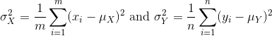

---
# Please do not edit this file directly; it is auto generated.
# Instead, please edit 03-inference-pse.md in _episodes_rmd/
title: "Populations, Samples and Estimates "
teaching: 0
exercises: 0
questions:
- "What is a parameter from a population?"
- "What are sample estimates?" 
- "How can we use sample estimates to make inferences about population parameters?"
objectives:
- "Understand the difference between parameters and statistics."
- "Calculate population means and sample means."
- "Calculate the difference between the means of two subgroups."
keypoints:
- "Parameters are measures of populations."
- "Statistics are measures of samples drawn from populations."
- "Statistical inference is the process of using sample statistics to answer questions about population parameters."
source: Rmd
---

## Populations, Samples and Estimates 
We can never know the true mean or variance of an entire population. Why not? 
Because we can't feasibly measure every member of a population. We can never 
know the true mean blood pressure of all mice, for example, even if all are from 
one strain, because we can't afford to buy them all or even find them all. We 
can never know the true mean blood pressure of all people on a Western diet, for 
example, because we can't possibly measure the entire population that's on a 
Western diet. If we could measure all people on a Western diet, we really are 
interested in the difference in means between people on a Western vs. non high 
fat high sugar diet because we want to know what effect the diet has on people. 
If there is no difference in means, we can say that there is no effect of diet. 
If there is a difference in means, we can say that the diet has an effect. The 
question we are asking can be expressed as:

We can even compare more than two means.  The three normal curves below help to visualize a question comparing the means of each curve to one of the others. 

We also want to know the variance from the mean, so that we have a sense of the 
spread of measurement around the mean.

In reality we use sample estimates of population parameters. The true population 
parameters that we are interested in are mean and standard deviation. Here we 
learn how taking a sample permits us to answer our questions about differences 
between groups. This is the essence of statistical inference.

Now that we have introduced the idea of a random variable, a null distribution, 
and a p-value, we are ready to describe the mathematical theory that permits us 
to compute p-values in practice. We will also learn about confidence intervals 
and power calculations.

#### Population parameters

A first step in statistical inference is to understand what population you are 
interested in. In the mouse weight example, we have two
populations: female mice on control diets and female mice on high fat
diets, with weight being the outcome of interest. We consider this
population to be fixed, and the randomness comes from the
sampling. One reason we have been using this dataset as an example is
because we happen to have the weights of all the mice of this
type. We download 
[this](https://raw.githubusercontent.com/genomicsclass/dagdata/master/inst/extdata/mice_pheno.csv) 
file to our working directory and read in to R:

~~~
pheno <- read.csv(file = "../data/mice_pheno.csv")
~~~
{: .language-r}

We can then access the population values and determine, for example, how many we 
have. Here we compute the size of the control population:

~~~
controlPopulation <- filter(pheno, Sex == "F" & Diet == "chow") %>%
  select(Bodyweight) %>% unlist
length(controlPopulation)
~~~
{: .language-r}

~~~
[1] 225
~~~
{: .output}

We usually denote these values as <i>x 1,...,xm</i>. In 
this case, *m* is the number computed above. We can do the same for the high fat 
diet population:

~~~
hfPopulation <- filter(pheno, Sex == "F" & Diet == "hf") %>%  
  select(Bodyweight) %>% unlist
length(hfPopulation)
~~~
{: .language-r}

~~~
[1] 200
~~~
{: .output}

and denote with <i>y 1,...,yn</i>.

We can then define summaries of interest for these populations, such as the mean 
and variance. 

The mean:

~~~
# X is the control population
sum(controlPopulation) # sum of the xsubi's
~~~
{: .language-r}

~~~
[1] 5376.01
~~~
{: .output}

~~~
length(controlPopulation) # this equals m
~~~
{: .language-r}

~~~
[1] 225
~~~
{: .output}

~~~
sum(controlPopulation)/length(controlPopulation) # this equals mu sub x
~~~
{: .language-r}

~~~
[1] 23.89338
~~~
{: .output}

~~~
# Y is the high fat diet population
sum(hfPopulation) # sum of the ysubi's
~~~
{: .language-r}

~~~
[1] 5253.779
~~~
{: .output}

~~~
sum(hfPopulation)/length(hfPopulation) # this equals mu sub y
~~~
{: .language-r}

~~~
[1] 26.2689
~~~
{: .output}

The variance:

with the standard deviation being the square root of the variance. We refer to 
such quantities that can be obtained from the population as 
*population parameters*. The question we started out asking can now be written 
mathematically: <strong>is <i>&mu;Y - &mu;X = 0</i></strong> ? 

Although in our illustration we have all the values and can check if this is 
true, in practice we do not. For example, in practice it would be prohibitively 
expensive to buy all the mice in a population. Here we learn how taking a 
*sample* permits us to answer our questions. <strong><i>This is the essence of 
statistical inference.</i></strong>

#### Sample estimates
In the previous chapter, we obtained samples of 12 mice from each population. We 
represent data from samples with capital letters to indicate that they are 
random. This is common practice in statistics, although it is not always 
followed. So the samples are <i>X 1,...,XM</i> and 
<i>Y 1,...,YN</i> and, in this case, <i>&Nu;=&Mu;=12</i>. 
In contrast and as we saw above, when we list out the values of the population, 
which are set and not random, we use lower-case letters.

Since we want to know if <i>&mu;Y - &mu;X = 0</i>,
we consider the sample version: <i>Y&#772;-X&#772;</i> with:

 

Note that this difference of averages is also a random variable. Previously, we 
learned about the behavior of random variables with an exercise that involved 
repeatedly sampling from the original distribution. Of course, this is not an 
exercise that we can execute in practice. In this particular case it would 
involve buying 24 mice over and over again. Here we described the mathematical 
theory that mathematically relates <i>X&#772;</i> to <i>&mu;X</i>
and <i>Y&#772;</i> to <i>&mu;Y</i>, that will in turn help us 
understand the relationship between <i>Y&#772;-X&#772;</i> and 
<i>&mu;Y - &mu;X</i>. Specifically, we will describe how 
the Central Limit Theorem permits us to use an approximation to answer this 
question, as well as motivate the widely used t-distribution.

> ## Exercise  
> We will use the mouse phenotype data. Remove the observations that contain missing 
> values:  
> 
> `pheno <- na.omit(pheno)`  
> 
> Use `dplyr` to create a vector `x` with the body weight of all males on the 
> control (chow) diet.   
> What is this population’s average body weight?  
>
> > ## Solution
> >
> > 
> > ~~~
> > # Omit observations with missing data
> > pheno <- na.omit(pheno)
> > 
> > # Create subset of males on chow diet
> > x <- pheno %>%
> >   filter(Diet == "chow" & Sex == "M") %>%
> >   select(Bodyweight) %>%
> >   unlist
> > 
> > # Calculate mean weight
> > mean(x)
> > ~~~
> > {: .language-r}
> > 
> > 
> > 
> > ~~~
> > [1] 30.96381
> > ~~~
> > {: .output}
> {: .solution}
>
> Set the seed at 1. Take a random sample `X` of size 25 from `x`. What is 
> the sample average?
> 
> > ## Solution
> >
> > 
> > ~~~
> > set.seed(1)
> > x_sample <- sample(x, 25)
> > mean(x_sample)
> > ~~~
> > {: .language-r}
> > 
> > 
> > 
> > ~~~
> > [1] 30.5196
> > ~~~
> > {: .output}
> {: .solution}
> 
> Use `dplyr` to create a vector `y` with the body weight of all males on the 
> high fat (hf) diet.  
> What is this population’s average?
> 
> > ## Solution
> >
> > 
> > ~~~
> > # Create subset of males on high fat diet
> > y <- pheno %>%
> >   filter(Diet == "hf" & Sex == "M") %>%
> >   select(Bodyweight) %>%
> >   unlist
> > 
> > # Calculate the mean weight
> > mean(y)
> > ~~~
> > {: .language-r}
> > 
> > 
> > 
> > ~~~
> > [1] 34.84793
> > ~~~
> > {: .output}
> {: .solution}
> 
> Set the seed at 1. Take a random sample `Y` of size 25 from `y`. What is 
> the sample average? 
>
> > ## Solution
> >
> > 
> > ~~~
> > set.seed(1)
> > y_sample <- sample(y, 25)
> > mean(y_sample)
> > ~~~
> > {: .language-r}
> > 
> > 
> > 
> > ~~~
> > [1] 35.8036
> > ~~~
> > {: .output}
> {: .solution}
>
> What is the difference in absolute value between <i>x&#772;-y&#772;</i> and 
> <i>X&#772;-Y&#772;</i>?  
> 
> > ## Solution
> >
> > 
> > ~~~
> > # mu_x - mu_y
> > pop_mean_diff <- abs(mean(x) - mean(y))
> > # x-bar - y-bar
> > sample_mean_diff <- abs(mean(x_sample) - mean(y_sample))
> > # difference in absolute value between (mu_x - mu_y) - (x-bar - y-bar)
> > pop_sample_mean_diff <- abs(pop_mean_diff - sample_mean_diff)
> > 
> > pop_sample_mean_diff
> > ~~~
> > {: .language-r}
> > 
> > 
> > 
> > ~~~
> > [1] 1.399884
> > ~~~
> > {: .output}
> {: .solution}
> 
> Repeat the above for females. Make sure to set the seed to 1 before each 
> sample call. What is the difference 
> in absolute value between <i>x&#772;-y&#772;</i> and <i>X&#772;-Y&#772;</i>?
> 
> > ## Solution
> >
> > 
> > ~~~
> > x_f <- pheno %>%
> >     filter(Diet == "chow" & Sex == "F") %>%
> >     select(Bodyweight) %>%
> >     unlist
> > mean(x_f)
> > ~~~
> > {: .language-r}
> > 
> > 
> > 
> > ~~~
> > [1] 23.89338
> > ~~~
> > {: .output}
> > 
> > 
> > 
> > ~~~
> > set.seed(1)
> > x_f_sample <- sample(x_f, 25)
> > mean(x_f_sample)
> > ~~~
> > {: .language-r}
> > 
> > 
> > 
> > ~~~
> > [1] 24.2528
> > ~~~
> > {: .output}
> > 
> > 
> > 
> > ~~~
> > y_f <- pheno %>%
> >     filter(Diet == "hf" & Sex == "F") %>%
> >     select(Bodyweight) %>%
> >     unlist
> > mean(y_f)
> > ~~~
> > {: .language-r}
> > 
> > 
> > 
> > ~~~
> > [1] 26.2689
> > ~~~
> > {: .output}
> > 
> > 
> > 
> > ~~~
> > set.seed(1)
> > y_f_sample <- sample(y_f, 25)
> > mean(y_f_sample)
> > ~~~
> > {: .language-r}
> > 
> > 
> > 
> > ~~~
> > [1] 28.3828
> > ~~~
> > {: .output}
> > 
> > 
> > 
> > ~~~
> > pop_mean_diff_f <- abs(mean(x_f) - mean(y_f))
> > sample_mean_diff_f <- abs(mean(x_f_sample) - mean(y_f_sample))
> > pop_sample_mean_diff_f <- abs(pop_mean_diff_f - sample_mean_diff_f)
> > 
> > pop_sample_mean_diff_f
> > ~~~
> > {: .language-r}
> > 
> > 
> > 
> > ~~~
> > [1] 1.754483
> > ~~~
> > {: .output}
> {: .solution}
> 
{: .challenge}
