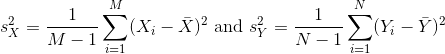

---
# Please do not edit this file directly; it is auto generated.
# Instead, please edit 04-inference-clt.md in _episodes_rmd/
title: "Central Limit Theorem and the t-distribution "
teaching: 0
exercises: 0
questions:
- "What is a parameter from a population?"
objectives:
- ""
- ""
- ""
keypoints:
- "."
- "."
- "."
- "."
source: Rmd
---

## Central Limit Theorem and t-distribution
Below we will discuss the Central Limit Theorem (CLT) and the t-distribution, both of which help us make important calculations related to probabilities. Both are frequently used in science to test statistical hypotheses. To use these, we have to make different assumptions from those for the CLT and the t-distribution. However, if the assumptions are true, then we are able to calculate the exact probabilities of events through the use of mathematical formula.

#### Central Limit Theorem 

The CLT is one of the most frequently used mathematical results in science. It tells us that when the sample size is large, the average Y&#772; of a random sample follows a normal distribution centered at the population average &mu;Y and with standard deviation equal to the population standard deviation &sigma;Y, divided by the square root of the sample size *N*. We refer to the standard deviation of the distribution of a random variable as the random variable's *standard error*.

This implies that if we take many samples of size *N*, then the quantity: 

is approximated with a normal distribution centered at 0 and with standard deviation 1.

We are interested in the difference between two sample averages. Again, applying certain mathematical principles, it can be implied that the below ratio:  

is approximated by a normal distribution centered at 0 and standard deviation 1. Calculating p-values for the standard normal distribution is simple because we know the proportion of the distribution under any value. For example, only 5% of the values in the standard normal distribution are larger than 2 (in absolute value):

~~~
pnorm(-2) + (1 - pnorm(2))
~~~
{: .language-r}

~~~
[1] 0.04550026
~~~
{: .output}

We don't need to buy more mice, 12 and 12 suffice.

However, we can't claim victory just yet because we don't know the population standard deviations: &sigma;X and &sigma;Y. These are unknown population parameters, but we can get around this by using the sample standard deviations, call them *sX* and *sY*. These are defined as: 

Note that we are dividing by *M-1* and *N-1*, instead of by *M* and *N*. There is a theoretical reason for doing this which we do not explain here.

So we can redefine our ratio as

if *M = N* or in general,

The CLT tells us that when *M* and *N* are large, this random variable is normally distributed with mean 0 and SD 1. Thus we can compute p-values using the function `pnorm`.

#### The t-distribution

The CLT relies on large samples, what we refer to as *asymptotic results*. When the CLT does not apply, there is another option that does not rely on asymptotic results. When the original population from which a random variable, say *Y*, is sampled is normally distributed with mean 0, then we can calculate the distribution of: 

This is the ratio of two random variables so it is not
necessarily normal. The fact that the denominator can be small by
chance increases the probability of observing large
values. [William Sealy Gosset](http://en.wikipedia.org/wiki/William_Sealy_Gosset),
an employee of the Guinness brewing company, deciphered the
distribution of this random variable and published a paper under the
pseudonym "Student". The distribution is therefore called Student's
t-distribution. Later we will learn more about how this result is
used.

> ## Exercise 1  
> 1. If a list of numbers has a distribution that is well approximated
> by the normal distribution, what proportion of these numbers are
> within one standard deviation away from the list’s average?  
> 2. What proportion of these numbers are within two standard
> deviations away from the list’s average?  
> 3. What proportion of these numbers are within three standard
> deviations away from the list’s average?  
> 4. Define y to be the weights of males on the control diet. 
> What proportion of the mice are within one standard deviation away
> from the average weight (remember to use `popsd` for the
> population sd)?  
> 5. What proportion of these numbers are within two standard deviations
> away from the list’s average?  
> 6. What proportion of these numbers are within three standard
> deviations away from the list’s average?  
> 7. Note that the numbers for the normal distribution and our weights
> are relatively close. Also, notice that we are indirectly comparing
> quantiles of the normal distribution to quantiles of the mouse weight
> distribution. We can actually compare all quantiles using a
> qqplot. Which of the following best describes the qq-plot comparing
> mouse weights to the normal distribution?  
> A) The points on the qq-plot fall exactly on the identity line.    
> B) The average of the mouse weights is not 0 and thus it can’t follow a normal distribution.   
> C) The mouse weights are well approximated by the normal
> distribution, although the larger values (right tail) are larger than
> predicted by the normal. This is consistent with the differences seen
> between question 3 and 6.  
> D) These are not random variables and thus they can’t follow a normal distribution.  
> 8. Create the above qq-plot for the four populations: male/females on
> each of the two diets. What is the most likely explanation for the
> mouse weights being well approximated?   
> What is the best explanation for all these being well approximated by
> the normal distribution?  
> A) The CLT tells us that sample averages are approximately normal.  
> B) This just happens to be how nature behaves, perhaps the result of
> many biological factors averaging out.  
> C) Everything measured in nature follows a normal distribution.  
> D) Measurement error is normally distributed.
>
> > ## Solution to Exercise 1
> {: .solution}
{: .challenge}

> ## Exercise 2
> Here we are going to use the function `replicate` to learn about
> the distribution of random variables. All the above exercises relate
> to the normal distribution as an approximation of the distribution of
> a fixed list of numbers or a population. We have not yet discussed
> probability in these exercises. If the distribution of a list of  numbers
> is approximately normal, then if we pick a number at random from this
> distribution, it will follow a normal distribution. However, it is
> important to remember that stating that some quantity has a
> distribution does not necessarily imply this quantity is random.
> Also, keep in mind that this is not related to the central limit
> theorem. The central limit applies to averages of random variables.
> Let’s explore this concept.  
> We will now take a sample of size 25 from the population of males on the chow diet. 
> The average of this sample is our random variable. We will use the replicate to observe
> 10,000 realizations of this random variable.  
> 1. Set the seed at 1, generate these 10,000 averages.  
> `set.seed(1)`  
> `y <- filter(pheno, Sex=="M" & Diet=="chow") %>%`   
> `select(Bodyweight) %>%`   
> `unlist`  
> `avgs <- replicate(10000, mean(sample(y,25)))`   
> 2. Make a histogram and qq-plot these 10,000 numbers against the normal distribution. 
> `mypar(1,2)`  
> `hist(avgs)`  
> `qqnorm(avgs)`  
> `qqline(avgs)`  
> We can see that, as predicted by the CLT, the distribution of the
> random variable is very well approximated by the normal distribution.  
> 3. What is the average of the distribution of the sample average?  
> 4. What is the standard deviation of the distribution of sample averages?  
> According to the CLT, the answer to the exercise above should be the
> same as `mean(y)`. You should be able to confirm that these two
> numbers are very close. 
> 5. Which of the following does the CLT tell us
> should be close to your answer to this exercise?  
> A) `popsd(y)`  
> B) `popsd(avgs)/sqrt(25)`  
> C) `sqrt(25) / popsd(y)`  
> D) `popsd(y)/sqrt(25)`
>
> > ## Solution to Exercise 2
> {: .solution}
{: .challenge}

Here we will use the mice phenotype data as an example. We start by
creating two vectors, one for the control population and one for the
high-fat diet population:

~~~
# pheno <- read.csv("mice_pheno.csv") #We downloaded this file in a previous section
controlPopulation <- filter(pheno, Sex == "F" & Diet == "chow") %>%  
  select(Bodyweight) %>% unlist
hfPopulation <- filter(pheno, Sex == "F" & Diet == "hf") %>%  
  select(Bodyweight) %>% unlist
~~~
{: .language-r}

It is important to keep in mind that what we are assuming to be normal here is the distribution of <i>y1,y2,...,yn</i>, not the random variable Y&#772;. Although we can't do this in practice, in this illustrative example, we get to see this distribution for both controls and high fat diet mice:

~~~
library(rafalib)
mypar(1,2)
hist(hfPopulation)
hist(controlPopulation)
~~~
{: .language-r}

We can use *qq-plots* to confirm that the distributions are relatively
close to being normally distributed. We will explore these plots in
more depth in a later section, but the important thing to know is that
it compares data (on the y-axis) against a theoretical distribution
(on the x-axis). If the points fall on the identity line, then the
data is close to the theoretical distribution.

~~~
mypar(1,2)
qqnorm(hfPopulation)
qqline(hfPopulation)
qqnorm(controlPopulation)
qqline(controlPopulation)
~~~
{: .language-r}

The larger the sample, the more forgiving the result is to the
weakness of this approximation. In the next section, we will see that
for this particular dataset the t-distribution works well even for
sample sizes as small as 3. 

All the above exercises relate to the normal distribution as an approximation of the distribution of a fixed list of numbers or a population. We have not yet discussed probability in these exercises. If the distribution of a list of numbers is approximately normal, then if we pick a number at random from this distribution, it will follow a normal distribution. However, it is important to remember that stating that some quantity has a distribution does not necessarily imply this quantity is random. Also, keep in mind that this is not related to the central limit theorem. The central limit applies to averages of random variables. Let’s explore this concept.

> ## Exercise 3
> We will now take a sample of size 25 from the population of males on the chow
> diet. The average of this sample is our random variable. We will use 
> `replicate` to observe 10,000 realizations of this random variable.   
> 1. Set the seed at 1.  
> 2. Generate these 10,000 averages.  
> 3. Make a histogram and qq-plot of these 10,000 numbers against the normal
> distribution.   
> `y <- filter(dat, Sex=="M" & Diet=="chow") %>%`  
> `select(Bodyweight) %>%`  
> `unlist`  
> `avgs <- replicate(10000, mean( sample(y,25)))`  
> `mypar(1,2)`  
> `hist(avgs)`  
> `qqnorm(avgs)`  
> `qqline(avgs)`  
> We can see that, as predicted by the CLT, the distribution of the random 
> variable is very well approximated by the normal distribution.  
> 4. What is the average of the distribution of the sample average?  
> 5. What is the standard deviation of the distribution of sample averages?  
> 6. According to the CLT, the answer to exercise 9 should be the same as
> `mean(y)`. You should be able to confirm that these two numbers are very 
> close. Which of the following does the CLT tell us should be close to your 
> answer to exercise 5?  
> A) `popsd(y)`  
> B) `popsd(avgs) / sqrt(25)`  
> C) `sqrt(25) / popsd(y)`  
> D) `popsd(y) / sqrt(25)`  
> 7. In practice we do not know `(popsd(y))` which is why we can’t use the CLT 
> directly. This is because we see a sample and not the entire distribution. We 
> also can’t use `popsd(avgs)` because to construct averages, we have to take
> 10,000 samples and this is never practical. We usually just get one sample.
> Instead we have to estimate `popsd(y)`. As described, what we use is the 
> sample standard deviation.  
> Set the seed at 1. Using the`replicate` function, create 10,000 samples of 25 
> and now, instead of the sample average, keep the standard deviation. Look at 
> the distribution of the sample standard deviations. It is a random variable. 
> The real population SD is about 4.5. What proportion of the sample SDs are 
> below 3.5?  
> 8. What the answer to question 7 reveals is that the denominator of the t-test 
> is a random variable. By decreasing the sample size, you can see how this
> variability can increase. It therefore adds variability. The smaller the 
> sample size, the more variability is added. The normal distribution stops
> providing a useful approximation. When the distribution of the population 
> values is approximately normal, as it is for the weights, the
> t-distribution provides a better approximation. We will see this later on. 
> Here we will look at the difference between the t-distribution and normal. Use
> the function `qt` and `qnorm` to get the quantiles of 
> `x=seq(0.0001, 0.9999, len=300)`. Do this for degrees of freedom 3, 10, 30, 
> and 100. Which of the following is true?  
> A) The t-distribution and normal distribution are always the same.  
> B) The t-distribution has a higher average than the normal distribution.  
> C) The t-distribution has larger tails up until 30 degrees of freedom, at 
> which point itis practically the same as the normal distribution.  
> D) The variance of the t-distribution grows as the degrees of freedom grow.  
> > ## Solution to Exercise 3
> {: .solution}
{: .challenge}
