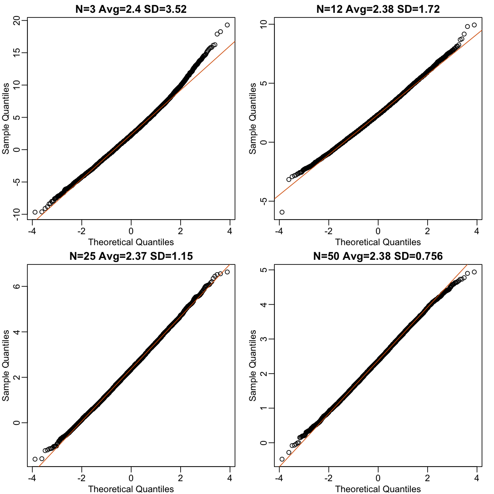
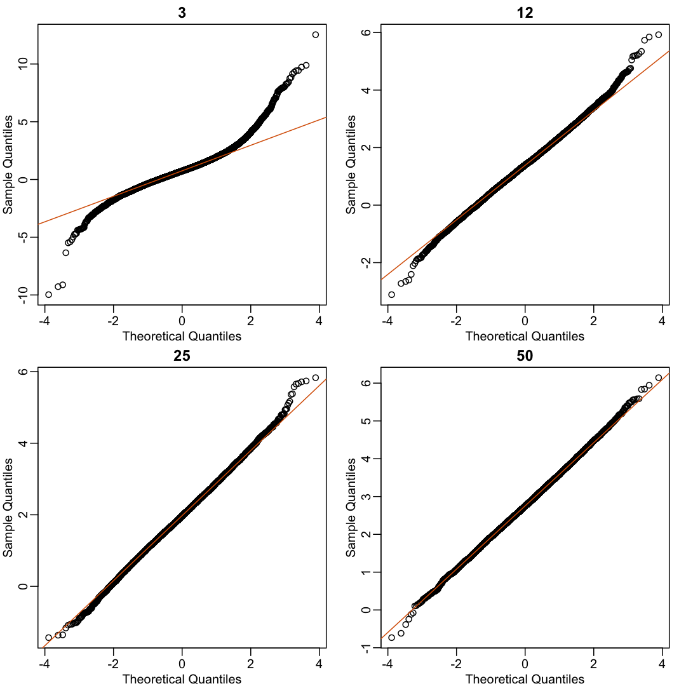

---
# Please do not edit this file directly; it is auto generated.
# Instead, please edit 05-inference-clt-practice.md in _episodes_rmd/
title: "Central Limit Theorem in practice "
teaching: 0
exercises: 0
questions:
- "How is the CLT used in practice?"
objectives:
- ""
- ""
- ""
keypoints:
- "."
- "."
- "."
- "."
source: Rmd
---

## Central Limit Theorem in Practice

Let's use our data to see how well the central limit theorem approximates sample averages from our data. We will leverage our entire population dataset to compare the results we obtain by actually sampling from the distribution to what the CLT predicts.

~~~
# pheno <- read.csv("mice_pheno.csv") #file was previously downloaded
head(pheno)
~~~
{: .language-r}

~~~
  Sex Diet Bodyweight
1   F   hf      31.94
2   F   hf      32.48
3   F   hf      22.82
4   F   hf      19.92
5   F   hf      32.22
6   F   hf      27.50
~~~
{: .output}

Start by selecting only female mice since males and females have
different weights. We will select three mice from each population.

~~~
library(dplyr)
controlPopulation <- filter(pheno, Sex == "F" & Diet == "chow") %>%  
  select(Bodyweight) %>% unlist
hfPopulation <- filter(pheno, Sex == "F" & Diet == "hf") %>%  
  select(Bodyweight) %>% unlist
~~~
{: .language-r}

We can compute the population parameters of interest using the mean function.

~~~
mu_hf <- mean(hfPopulation)
mu_control <- mean(controlPopulation)
print(mu_hf - mu_control)
~~~
{: .language-r}

~~~
[1] 2.375517
~~~
{: .output}

We can compute the population standard deviations of, say, a vector <i>x</i> as well. However, we do not use the R function `sd` because this function actually does not compute the population standard deviation <i>&sigma;x</i>. Instead, `sd` assumes the main argument is a random sample, say <i>X</i>, and provides an estimate of <i>&sigma;x</i>, defined by <i>sX</i> above. As shown in the equations above the actual final answer differs because one divides by the sample size and the other by the sample size minus one. We can see that with R code:

~~~
x <- controlPopulation
N <- length(x)
populationvar <- mean((x-mean(x))^2)
identical(var(x), populationvar)
~~~
{: .language-r}

~~~
[1] FALSE
~~~
{: .output}

~~~
identical(var(x)*(N-1)/N, populationvar)
~~~
{: .language-r}

~~~
[1] TRUE
~~~
{: .output}

So to be mathematically correct, we do not use `sd` or  `var`. Instead, we use the `popvar` and `popsd` function in `rafalib`:

~~~
library(rafalib)
sd_hf <- popsd(hfPopulation)
sd_control <- popsd(controlPopulation)
~~~
{: .language-r}

Remember that in practice we do not get to compute these population parameters.
These are values we never see. In general, we want to estimate them from samples. 

~~~
N <- 12
hf <- sample(hfPopulation, 12)
control <- sample(controlPopulation, 12)
~~~
{: .language-r}

As we described, the CLT tells us that for large <i>N</i>, each of these is approximately normal with average population mean and standard error population variance divided by <i>N</i>. We mentioned that a rule of thumb is that <i>N</i> should be 30 or more. However, that is just a rule of thumb since the preciseness of the approximation depends on the population distribution. Here we can actually check the approximation and we do that for various values of <i>N</i>.

Now we use `sapply` and `replicate` instead of `for` loops, which
makes for cleaner code (we do not have to pre-allocate a vector, R
takes care of this for us):

~~~
Ns <- c(3,12,25,50)
B <- 10000 #number of simulations
res <-  sapply(Ns,function(n) {
  replicate(B,mean(sample(hfPopulation,n))-mean(sample(controlPopulation,n)))
})
~~~
{: .language-r}

Now we can use qq-plots to see how well CLT approximations works for these. If in fact the normal distribution is a good approximation, the points should fall on a straight line when compared to normal quantiles. The more it deviates, the worse the approximation. In the title, we also show the average and SD of the observed distribution, which demonstrates how the SD decreases with <i>&radic;N</i> as predicted. 

~~~
mypar(2,2)
for (i in seq(along=Ns)) {
  titleavg <- signif(mean(res[,i]), 3)
  titlesd <- signif(popsd(res[,i]), 3)
  title <- paste0("N=", Ns[i]," Avg=", titleavg," SD=", titlesd)
  qqnorm(res[,i], main=title)
  qqline(res[,i], col=2)
}
~~~
{: .language-r}

Here we see a pretty good fit even for 3. Why is this? Because the
population itself is relatively close to normally distributed, the
averages are close to normal as well (the sum of normals is also a
normal). In practice, we actually calculate a ratio: we divide by the
estimated standard deviation. Here is where the sample size starts to
matter more. 

~~~
Ns <- c(3, 12, 25, 50)
B <- 10000 #number of simulations
##function to compute a t-stat
computetstat <- function(n) {
  y <- sample(hfPopulation, n)
  x <- sample(controlPopulation, n)
  (mean(y) - mean(x))/sqrt(var(y)/n + var(x)/n)
}
res <-  sapply(Ns, function(n) {
  replicate(B, computetstat(n))
})
mypar(2,2)
for (i in seq(along=Ns)) {
  qqnorm(res[,i], main=Ns[i])
  qqline(res[,i], col=2)
}
~~~
{: .language-r}

So we see that for <i>N = 3</i>, the CLT does not provide a usable
approximation. For <i>N = 12</i>, there is a slight deviation at the higher
values, although the approximation appears useful. For 25 and 50, the
approximation is spot on.

This simulation only proves that <i>N = 12</i> is large enough in this case,
not in general. As mentioned above, we will not be able to perform
this simulation in most situations. We only use the simulation to
illustrate the concepts behind the CLT and its limitations. In future
sections, we will describe the approaches we actually use in practice. 

These exercises use the female mouse weights data set we have previously 
downloaded.

> ## Exercise 1
> The CLT is a result from probability theory. Much of probability theory was 
> originally inspired by gambling. This theory is still used in practice by 
> casinos. For example, they can estimate how many people need to play
> slots for there to be a 99.9999% probability of earning enough money to cover
> expenses. Let’s try a simple example related to gambling. 
> Suppose we are interested in the proportion of times we see a 6 when rolling 
> n=100 die. This is a random variable which we can simulate with 
> `x=sample(1:6, n, replace=TRUE)` and the proportion we are interested in can 
> be expressed as an average: `mean(x==6)`. Because the die rolls are 
> independent, the CLT applies. We want to roll <i>n</i> dice 10,000 times and 
> keep these proportions. This random variable (proportion of 6s) has mean
> <i>p=1/6</i> and variance <i>p &times; (1-p)/n</i>. So according to 
> CLT <i>z</i> = `(mean(x==6) - p) / sqrt(p * (1-p)/n)` should be normal with 
> mean 0 and SD 1.  
> Set the seed to 1, then use `replicate` to perform the simulation, and report
> what proportion of times z was larger than 2 in absolute value (CLT says it
> should be about 0.05).
> > ## Solution to Exercise 1
> {: .solution}
{: .challenge}

> ## Exercise 2
> For the last simulation you can  make a `qqplot` to confirm the normal
> approximation. Now, the CLT is an asympototic result, meaning it is closer 
> and closer to being a perfect approximation as the sample size increases. 
> In practice, however, we need to decide if it is appropriate for actual sample
> sizes. Is 10 enough? 15? 30?
> In the example used in exercise 1, the original data is binary (either 6 or not).
> In this case, the success probability also affects the appropriateness of the 
> CLT. With very low probabilities, we need larger sample sizes for the CLT to 
> "kick in". Run the simulation from exercise 1, but for different values of
> <i>p</i> and <i>n</i>. 
> For which of the following is the normal approximation best?  
> A) <i>p</i>=0.5 and <i>n</i>=5  
> B) <i>p</i>=0.5 and <i>n</i>=30  
> C) <i>p</i>=0.01 and <i>n</i>=30  
> D) <i>p</i>=0.01 and <i>n</i>=100  
> > ## Solution to Exercise 2
> {: .solution}
{: .challenge}

> ## Exercise 3
> As we have already seen, the CLT also applies to averages of quantitative 
> data. A major difference with binary data, for which we know the variance 
> is <i>p(1 - p)</i>, is that with quantitative data we need to estimate the
> population standard deviation.
> In several previous exercises we have illustrated statistical concepts with 
> the unrealistic situation of having access to the entire population. 
> In practice, we do not have access to entire populations. Instead, we obtain 
> one random sample and need to reach conclusions analyzing that data. `pheno`
> is an example of a typical simple dataset representing just one sample.
> We have 12 measurements for each of two populations:
> 
> `X <- filter(dat, Diet=="chow") %>%`    
> `select(Bodyweight) %>%`  
> `unlist`  
> `Y <- filter(dat, Diet=="hf") %>%`   
> `select(Bodyweight) %>%`  
> `unlist`  
> We think of <i>X</i> as a random sample from the population of all mice in the 
> control diet and <i>Y</i> as a random sample from the population of all mice 
> in the high fat diet.  
> 1. Define the parameter <i>&mu;x</i> as the average of the control
> population. We estimate this parameter with the sample average X&#772;.
> What is the sample average?  
> 2. We don’t know <i>&mu;X</i>, but want to use X&#772; to
> understand <i>&mu;X</i>. Which of the following uses CLT to
> understand how well X&#772; approximates <i>&mu;X</i>?  
> A) X&#772; follows a normal distribution with mean 0 and standard 
> deviation 1.  
> B) <i>&mu;X</i> follows a normal distribution with mean
> X&#772; and standard deviation <i>&sigma;X/&radic;12</i> where
> <i>&sigma;X</i> is the population standard deviation.  
> C) X&#772; follows a normal distribution with mean <i>&mu;X</i> and
> standard deviation <i>&sigma;X</i> where <i>&sigma;X</i>
> is the population standard deviation.  
> D) X&#772; follows a normal distribution with mean <i>&mu;X</i> and
> standard deviation <i>&sigma;X/&radic;12</i> where 
> <i>&sigma;X</i> is the population standard deviation.  
> 3. The result above tells us the distribution of the following random 
> variable:  
> 
> What does the CLT tell us is the mean of <i>Z</i> (you don’t need code)?    
> 4. The result of 2 and 3 tell us that we know the distribution of the 
> difference between our estimate and what we want to estimate, but don’t know.
> However, the equation involves the population standard deviation
> <i>&sigma;X</i>, which we don’t know. Given what we discussed, what
> is your estimate of <i>&sigma;X</i>?  
> 5. Use the CLT to approximate the probability that our estimate X&#772; is off 
> by more than 5.21 ounces from <i>&mu;X</i>.  
> 6. Now we introduce the concept of a null hypothesis. We don’t know 
> <i>&mu;x</i> nor <i>&mu;y</i>. We want to quantify what 
> the data say about the possibility that the diet has no effect:
> <i>&mu;x = &mu;y</i>. If we use CLT, then we approximate
> the distribution of X&#772; as normal with mean <i>&mu;X</i> and 
> standard deviation <i>&sigma;X</i> and the distribution of Y&#772;
> as normal with mean <i>&mu;Y</i> and standard deviation 
> <i>&sigma;Y</i>. This implies that the difference Y&#772; - X&#772;
> has mean 0. We described that the standard deviation of this statistic 
> (the standard error) is
> 
> and that we estimate the population standard deviations 
> <i>&sigma;X</i> and <i>&sigma;Y</i> with the sample 
> estimates. What is the estimate of 
> 
> 7. So now we can compute Y&#772; - X&#772; as well as an estimate of this 
> standard error and construct a t-statistic. What is this t-statistic?  
> 8. If we apply the CLT, what is the distribution of this t-statistic?  
> A) Normal with mean 0 and standard deviation 1.  
> B) t-distributed with 22 degrees of freedom.  
> C) Normal with mean 0 and standard deviation
>   
> D) t-distributed with 12 degrees of freedom.  
> 9. Now we are ready to compute a p-value using the CLT. What is the 
> probability of observing a quantity as large as what we computed in 8, when 
> the null distribution is true?  
> 10. CLT provides an approximation for cases in which the sample size is large. 
> In practice, we can’t check the assumption because we only get to see 1 
> outcome (which you computed above). As a result, if this approximation is off, 
> so is our p-value. As described earlier, there is another approach that does 
> not require a large sample size, but rather that the distribution of the 
> population is approximately normal. We don’t get to see this distribution so 
> it is again an assumption, although we can look at the distribution of the 
> sample with `qqnorm(X)` and `qqnorm(Y)`. If we are willing to assume this, 
> then it follows that the t-statistic follows t-distribution. What is the 
> p-value under the t-distribution approximation? Hint: use the `t.test` 
> function.  
> 11. With the CLT distribution, we obtained a p-value smaller than 0.05 and 
> with the t-distribution, one that is larger. They can’t both be right. What 
> best describes the difference?  
> A) A sample size of 12 is not large enough, so we have to use the 
> t-distribution approximation.  
> B) These are two different assumptions. The t-distribution accounts for the
> variability introduced by the estimation of the standard error and thus, under
> the null, large values are more probable under the null distribution.  
> C) The population data is probably not normally distributed so the 
> t-distribution approximation is wrong.  
> D) Neither assumption is useful. Both are wrong.  
> > ## Solution to Exercise 3
> {: .solution}
{: .challenge}
