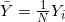
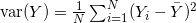
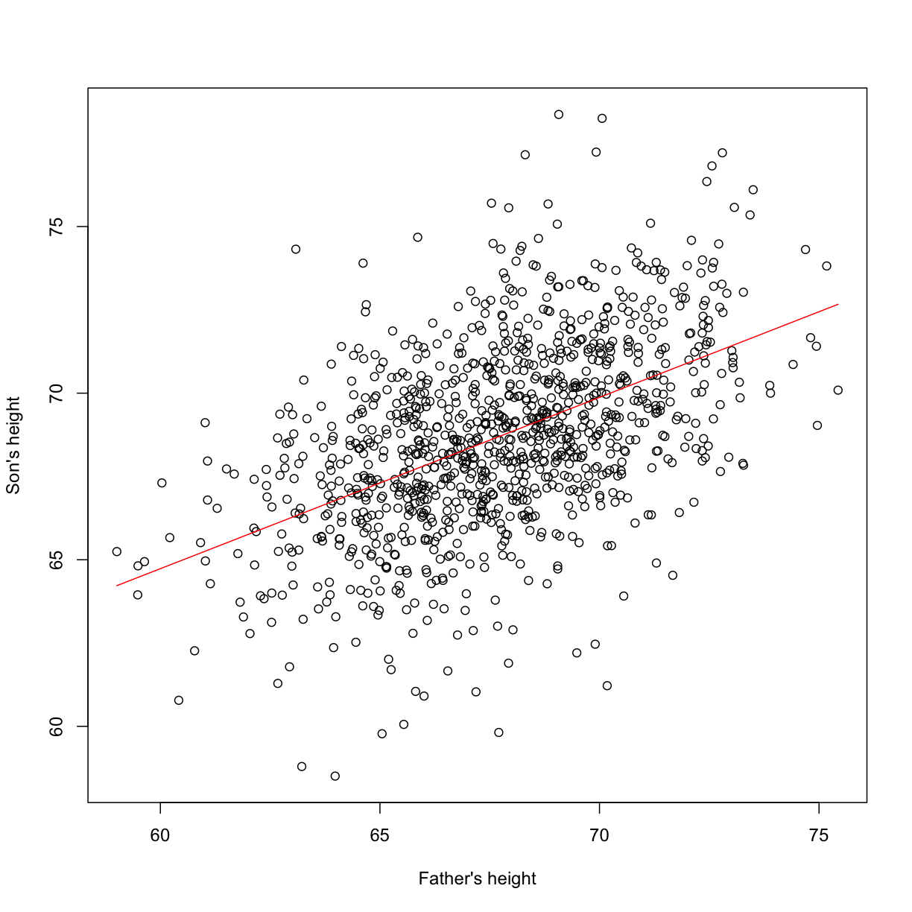

---
# Please do not edit this file directly; it is auto generated.
# Instead, please edit 05-matrix-algebra-examples.md in _episodes_rmd/
title: "Linear Algebra Examples"
teaching: 0
exercises: 0
questions:
- "?"
- "?"
- "?"
objectives:
- ""
- ""
- ""
- ""
- ""
- ""
- ""
keypoints:
- "."
- "."
- "."
- "."
source: Rmd
---

## Examples 

Now we are ready to see how matrix algebra can be useful when analyzing data. We start with some simple examples and eventually arrive at the main one: how to write linear models with matrix algebra notation and solve the least squares problem.

#### The average

To compute the sample average and variance of our data, we use these formulas  and .

We can represent these with matrix multiplication. First, define this <i>N \times 1</i> matrix made just of 1s:

<i>
A=\begin{pmatrix}
1\\
1\\
\vdots\\
1
\end{pmatrix}
</i>

This implies that:

<i>
\frac{1}{N}
\mathbf{A}^\top Y = \frac{1}{N}
\begin{pmatrix}1&1&\dots&1\end{pmatrix}
\begin{pmatrix}
Y_1\\
Y_2\\
\vdots\\
Y_N
\end{pmatrix}=
\frac{1}{N} \sum_{i=1}^N Y_i
= \oline{Y}
</i>

Note that we are multiplying by the scalar <i>1/N</i>. In R, we multiply matrix using `%*%`:

~~~
data(father.son,package="UsingR")
y <- father.son$sheight
print(mean(y))
~~~
{: .language-r}

~~~
[1] 68.68407
~~~
{: .output}

~~~
N <- length(y)
Y<- matrix(y,N,1)
A <- matrix(1,N,1)
barY=t(A)%*%Y / N

print(barY)
~~~
{: .language-r}

~~~
         [,1]
[1,] 68.68407
~~~
{: .output}

#### The variance

As we will see later, multiplying the transpose of a matrix with another is very common in statistics. In fact, it is so common that there is a function in R:

~~~
barY=crossprod(A,Y) / N
print(barY)
~~~
{: .language-r}

~~~
         [,1]
[1,] 68.68407
~~~
{: .output}

For the variance, we note that if:

<i>
\mathbf{r}\equiv \begin{pmatrix}
Y_1 - \oline{Y}\\
\vdots\\
Y_N - \oline{Y}
\end{pmatrix}, \,\,
\frac{1}{N} \mathbf{r}^\top\mathbf{r} = 
\frac{1}{N}\sum_{i=1}^N (Y_i - \oline{Y})^2
</i>

In R, if you only send one matrix into `crossprod`, it computes: <i>r^\top r</i> so we can simply type:

~~~
r <- y - barY
~~~
{: .language-r}

~~~
Warning in y - barY: Recycling array of length 1 in vector-array arithmetic is deprecated.
  Use c() or as.vector() instead.
~~~
{: .error}

~~~
crossprod(r)/N
~~~
{: .language-r}

~~~
         [,1]
[1,] 7.915196
~~~
{: .output}

Which is almost equivalent to:

~~~
library(rafalib)
~~~
{: .language-r}

~~~

Attaching package: 'rafalib'
~~~
{: .output}

~~~
The following object is masked from 'package:remotes':

    install_bioc
~~~
{: .output}

~~~
popvar(y) 
~~~
{: .language-r}

~~~
[1] 7.915196
~~~
{: .output}

#### Linear models

Now we are ready to put all this to use. Let's start with Galton's example. If we define these matrices:
 
<i>
\mathbf{Y} = \begin{pmatrix}
Y_1\\
Y_2\\
\vdots\\
Y_N
\end{pmatrix}
,
\mathbf{X} = \begin{pmatrix}
1&x_1\\
1&x_2\\
\vdots\\
1&x_N
\end{pmatrix}
,
\mathbf{\beta} = \begin{pmatrix}
\beta_0\\
\beta_1
\end{pmatrix} \mbox{ and }
\mathbf{\varepsilon} = \begin{pmatrix}
\varepsilon_1\\
\varepsilon_2\\
\vdots\\
\varepsilon_N
\end{pmatrix}
</i>

Then we can write the model:

<i>
Y_i = \beta_0 + \beta_1 x_i + \varepsilon_i, i=1,\dots,N 
</i>

as: 

<i>
\,
\begin{pmatrix}
Y_1\\
Y_2\\
\vdots\\
Y_N
\end{pmatrix} = 
\begin{pmatrix}
1&x_1\\
1&x_2\\
\vdots\\
1&x_N
\end{pmatrix}
\begin{pmatrix}
\beta_0\\
\beta_1
\end{pmatrix} +
\begin{pmatrix}
\varepsilon_1\\
\varepsilon_2\\
\vdots\\
\varepsilon_N
\end{pmatrix}
</i>

or simply: 

<i>
\mathbf{Y}=\mathbf{X}\boldsymbol{\beta}+\boldsymbol{\varepsilon}
</i>

which is a much simpler way to write it. 

The least squares equation becomes simpler as well since it is the following cross-product:

<i>
(\mathbf{Y}-\mathbf{X}\boldsymbol{\beta})^\top
(\mathbf{Y}-\mathbf{X}\boldsymbol{\beta})
</i>

So now we are ready to determine which values of <i>\beta</i> minimize the above, which we  can do  using calculus to find the minimum. 

#### Advanced: Finding the minimum using calculus

There are a series of rules that permit us to compute partial derivative equations in matrix notation. By equating the derivative to 0 and solving for the <i>\beta</i>, we will have our solution. The only one we need here tells us that the derivative of the above equation is:

<i>
2 \mathbf{X}^\top (\mathbf{Y} - \mathbf{X} \boldsymbol{\hat{\beta}})=0
</i>

<i>
\mathbf{X}^\top \mathbf{X} \boldsymbol{\hat{\beta}} = \mathbf{X}^\top \mathbf{Y}   
</i>

<i>
\boldsymbol{\hat{\beta}} = (\mathbf{X}^\top \mathbf{X})^{-1} \mathbf{X}^\top \mathbf{Y}   
</i>

and we have our solution. We usually put a hat on the <i>\beta</i> that solves this, <i>\hat{\beta}</i> , as it is an estimate of the "real" <i>\beta</i> that generated the data.

Remember that the least squares are like a square (multiply something by itself) and that this formula is similar to the derivative of <i>f(x)^2</i> being <i>2f(x)f\prime (x)</i>. 

#### Finding LSE in R

Let's see how it works in R:

~~~
data(father.son,package="UsingR")
x=father.son$fheight
y=father.son$sheight
X <- cbind(1,x)
betahat <- solve( t(X) %*% X ) %*% t(X) %*% y
###or
betahat <- solve( crossprod(X) ) %*% crossprod( X, y )
~~~
{: .language-r}

Now we can see the results of this by computing the estimated <i>\hat{\beta}_0+\hat{\beta}_1 x</i> for any value of <i>x</i>:

~~~
newx <- seq(min(x),max(x),len=100)
X <- cbind(1,newx)
fitted <- X%*%betahat
plot(x,y,xlab="Father's height",ylab="Son's height")
lines(newx,fitted,col=2)
~~~
{: .language-r}

This <i>\hat{\boldsymbol{\beta}}=(\mathbf{X}^\top \mathbf{X})^{-1} \mathbf{X}^\top \mathbf{Y}</i> is one of the most widely used results in data analysis. One of the advantages of this approach is that we can use it in many different situations.  For example, in our falling object problem: 
 

~~~
set.seed(1)
g <- 9.8 #meters per second
n <- 25
tt <- seq(0,3.4,len=n) #time in secs, t is a base function
d <- 56.67  - 0.5*g*tt^2 + rnorm(n,sd=1)
~~~
{: .language-r}

Notice that we are using almost the same exact code:

~~~
X <- cbind(1,tt,tt^2)
y <- d
betahat <- solve(crossprod(X))%*%crossprod(X,y)
newtt <- seq(min(tt),max(tt),len=100)
X <- cbind(1,newtt,newtt^2)
fitted <- X%*%betahat
plot(tt,y,xlab="Time",ylab="Height")
lines(newtt,fitted,col=2)
~~~
{: .language-r}

And the resulting estimates are what we expect:

~~~
betahat
~~~
{: .language-r}

~~~
         [,1]
   56.5317368
tt  0.5013565
   -5.0386455
~~~
{: .output}

The Tower of Pisa is about 56 meters high. Since we are just dropping the object there is no initial velocity, and half the constant of gravity is 9.8/2=4.9 meters per second squared.

#### The `lm` Function
R has a very convenient function that fits these models. We will learn more about this function later, but here is a preview:

~~~
X <- cbind(tt,tt^2)
fit=lm(y~X)
summary(fit)
~~~
{: .language-r}

~~~

Call:
lm(formula = y ~ X)

Residuals:
    Min      1Q  Median      3Q     Max 
-2.5295 -0.4882  0.2537  0.6560  1.5455 

Coefficients:
            Estimate Std. Error t value Pr(>|t|)    
(Intercept)  56.5317     0.5451 103.701   <2e-16 ***
Xtt           0.5014     0.7426   0.675    0.507    
X            -5.0386     0.2110 -23.884   <2e-16 ***
---
Signif. codes:  0 '***' 0.001 '**' 0.01 '*' 0.05 '.' 0.1 ' ' 1

Residual standard error: 0.9822 on 22 degrees of freedom
Multiple R-squared:  0.9973,	Adjusted R-squared:  0.997 
F-statistic:  4025 on 2 and 22 DF,  p-value: < 2.2e-16
~~~
{: .output}

Note that we obtain the same values as above.

#### Summary

We have shown how to write linear models using linear algebra. We are going to do this for several examples, many of which are related to designed experiments. We also demonstrated how to obtain least squares estimates. Nevertheless, it is important to remember that because <i>y</i> is a random variable, these estimates are random as well. In a later section, we will learn how to compute standard error for these estimates and use this to perform inference.
