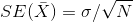
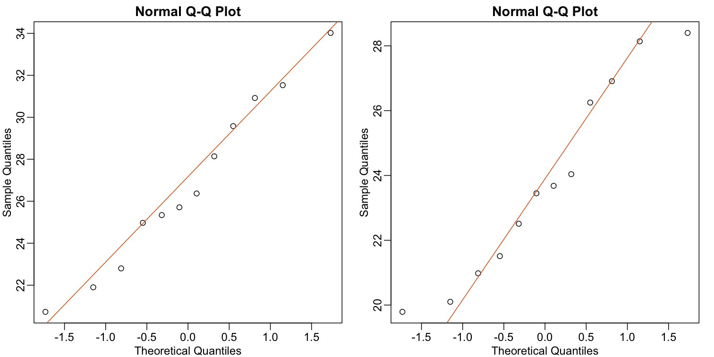

---
# Please do not edit this file directly; it is auto generated.
# Instead, please edit 06-inference-ttests-practice.md in _episodes_rmd/
title: "t-tests in practice "
teaching: 0
exercises: 0
questions:
- "How are t-tests used in practice?"
objectives:
- ""
- ""
- ""
keypoints:
- "."
- "."
- "."
- "."
source: Rmd
---

## t-tests in Practice

#### Introduction

We will now demonstrate how to obtain a p-value in practice. We begin by loading experimental data and walking you through the steps used to form a t-statistic and compute a p-value. We can perform this task with just a few lines of code (go to the end of this section to see them). However, to understand the concepts, we will construct a t-statistic from "scratch".

#### Read in and prepare data

We start by reading in the data. A first important step is to identify which rows are associated with treatment and control, and to compute the difference in mean. 

~~~
pheno <- read.csv(file = "../data/mice_pheno.csv") # we read this data in earlier
control <- filter(pheno, Diet=="chow") %>%
  select(Bodyweight) %>% 
  unlist
treatment <- filter(pheno, Diet=="hf") %>%
  select(Bodyweight) %>% 
  unlist
diff <- mean(treatment) - mean(control)
print(diff)
~~~
{: .language-r}

~~~
[1] NA
~~~
{: .output}

We are asked to report a p-value. What do we do? We learned that
`diff`, referred to as the _observed effect size_, is a random
variable. We also learned that under the null hypothesis, the mean of the distribution of `diff` is 0. What about the standard error? We also learned that the standard error of this random variable is the population standard deviation divided by the square root of the sample size:

We use the sample standard deviation as an estimate of the population
standard deviation. In R, we simply use the `sd` function and the SE is:

~~~
sd(control)/sqrt(length(control))
~~~
{: .language-r}

~~~
[1] NA
~~~
{: .output}

This is the SE of the sample average, but we actually want the SE of `diff`. We saw how statistical theory tells us that the variance of the difference of two random variables is the sum of its variances, so we compute the variance and take the square root:

~~~
se <- sqrt( 
  var(treatment)/length(treatment) + 
  var(control)/length(control) 
  )
~~~
{: .language-r}

Statistical theory tells us that if we divide a random variable by its SE, we get a new random variable with an SE of 1.

~~~
tstat <- diff/se 
~~~
{: .language-r}

This ratio is what we call the t-statistic. It's the ratio of two random variables and thus a random variable. Once we know the distribution of this random variable, we can then easily compute a p-value.

As explained in the previous section, the CLT tells us that for large sample sizes, both sample averages `mean(treatment)` and `mean(control)` are normal. Statistical theory tells us that the difference of two normally distributed random variables is again normal, so CLT tells us that `tstat` is approximately normal with mean 0 (the null hypothesis) and SD 1 (we divided by its SE). 

So now to calculate a p-value all we need to do is ask: how often does
a normally distributed random variable exceed `diff`? R has a built-in
function, `pnorm`, to answer this specific question. `pnorm(a)` returns
the probability that a random variable following the standard normal
distribution falls below `a`. To obtain the probability that it is
larger than `a`, we simply use `1-pnorm(a)`. We want to know the
probability of seeing something as extreme as `diff`: either smaller
(more negative) than `-abs(diff)` or larger than `abs(diff)`. We call
these two regions "tails" and calculate their size:

~~~
righttail <- 1 - pnorm(abs(tstat)) 
lefttail <- pnorm(-abs(tstat))
pval <- lefttail + righttail
print(pval)
~~~
{: .language-r}

~~~
[1] NA
~~~
{: .output}

In this case, the p-value is smaller than 0.05 and using the conventional cutoff of 0.05, we would call the difference _statistically significant_.

Now there is a problem. CLT works for large samples, but is 12 large enough? A rule of thumb for CLT is that 30 is a large enough sample size (but this is just a rule of thumb). The p-value we computed is only a valid approximation if the assumptions hold, which do not seem to be the case here. However, there is another option other than using CLT.

## The t-distribution in Practice

As described earlier, statistical theory offers another useful
result. If the distribution of the population is normal, then we can
work out the exact distribution of the t-statistic without the need
for the CLT. This is a big "if" given that, with small
samples, it is hard to check if the population is normal. But for
something like weight, we suspect that the population distribution is
likely well approximated by normal and that we can use this
approximation. Furthermore, we can look at a qq-plot for the
samples. This shows that the approximation is at least close: 

~~~
library(rafalib)
~~~
{: .language-r}

~~~

Attaching package: 'rafalib'
~~~
{: .output}

~~~
The following object is masked from 'package:remotes':

    install_bioc
~~~
{: .output}

~~~
mypar(1,2)
qqnorm(treatment)
qqline(treatment,col=2)
qqnorm(control)
qqline(control,col=2)
~~~
{: .language-r}

If we use this approximation, then statistical theory tells us that
the distribution of the random variable `tstat` follows a
t-distribution. This is a much more complicated distribution than the
normal. The t-distribution has a location parameter like the normal
and another parameter called *degrees of freedom*. R has a nice
function that actually computes everything for us. 

~~~
t.test(treatment, control)
~~~
{: .language-r}

~~~

	Welch Two Sample t-test

data:  treatment and control
t = 7.1932, df = 735.02, p-value = 1.563e-12
alternative hypothesis: true difference in means is not equal to 0
95 percent confidence interval:
 2.231533 3.906857
sample estimates:
mean of x mean of y 
 30.48201  27.41281 
~~~
{: .output}

To see just the p-value, we can use the `$` extractor:

~~~
result <- t.test(treatment,control)
result$p.value
~~~
{: .language-r}

~~~
[1] 1.562941e-12
~~~
{: .output}

The p-value is slightly bigger now. This is to be expected because our
CLT approximation considered the denominator of `tstat` practically
fixed (with large samples it practically is), while the t-distribution
approximation takes into account that the denominator (the standard
error of the difference) is a random variable. The smaller the
sample size, the more the denominator varies. 

It may be confusing that one approximation gave us one p-value and another gave us another, because we expect there to be just one answer. However, this is not uncommon in data analysis. We used different assumptions, different approximations, and therefore we obtained different results.

Later, in the power calculation section, we will describe type I and
type II errors. As a preview, we will point out that the test based on
the CLT approximation is more likely to incorrectly reject the null
hypothesis (a false positive), while the t-distribution is more likely
to incorrectly accept the null hypothesis (false negative).

#### Running the t-test in practice

Now that we have gone over the concepts, we can show the relatively
simple code that one would use to actually compute a t-test: 

~~~
control <- filter(pheno, Diet=="chow") %>%
  select(Bodyweight) %>% 
  unlist
treatment <- filter(pheno, Diet=="hf") %>%
  select(Bodyweight) %>% 
  unlist
t.test(treatment, control)
~~~
{: .language-r}

~~~

	Welch Two Sample t-test

data:  treatment and control
t = 7.1932, df = 735.02, p-value = 1.563e-12
alternative hypothesis: true difference in means is not equal to 0
95 percent confidence interval:
 2.231533 3.906857
sample estimates:
mean of x mean of y 
 30.48201  27.41281 
~~~
{: .output}

The arguments to `t.test` can be of type *data.frame* and thus we do not need to unlist them into numeric objects.
