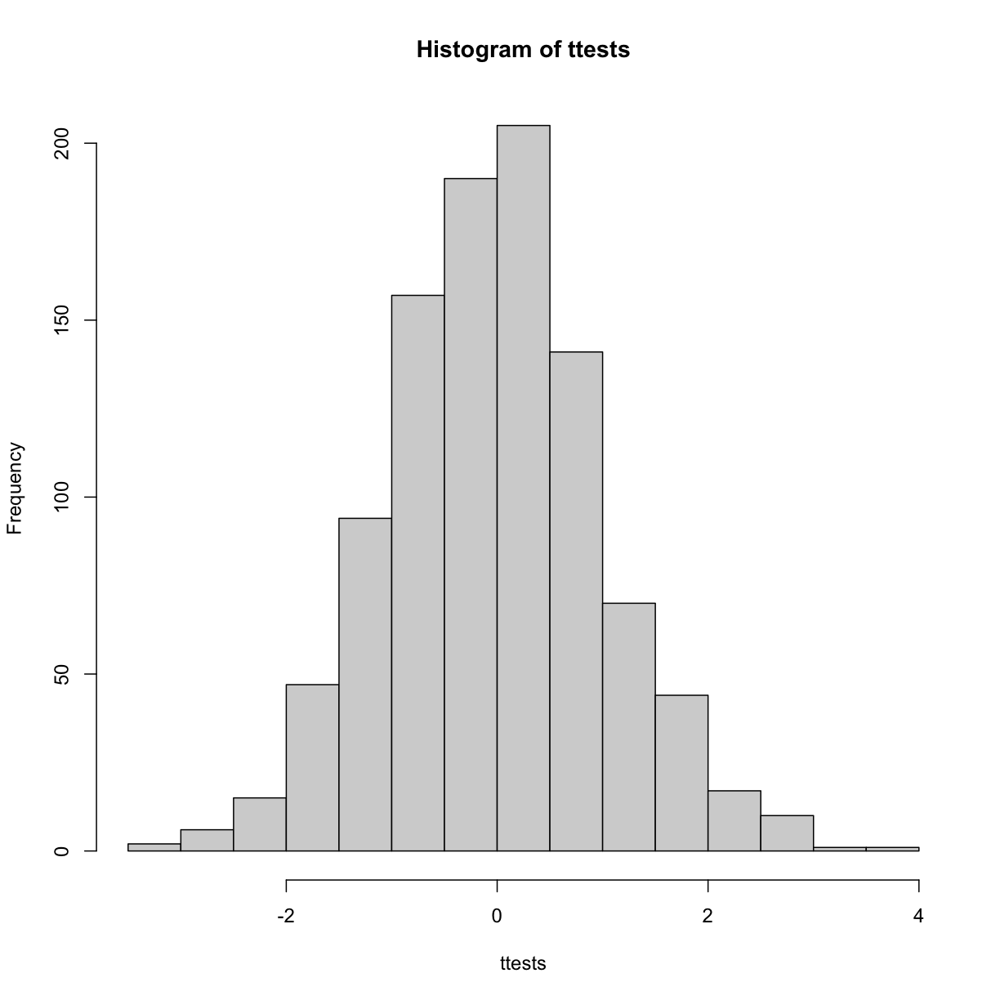
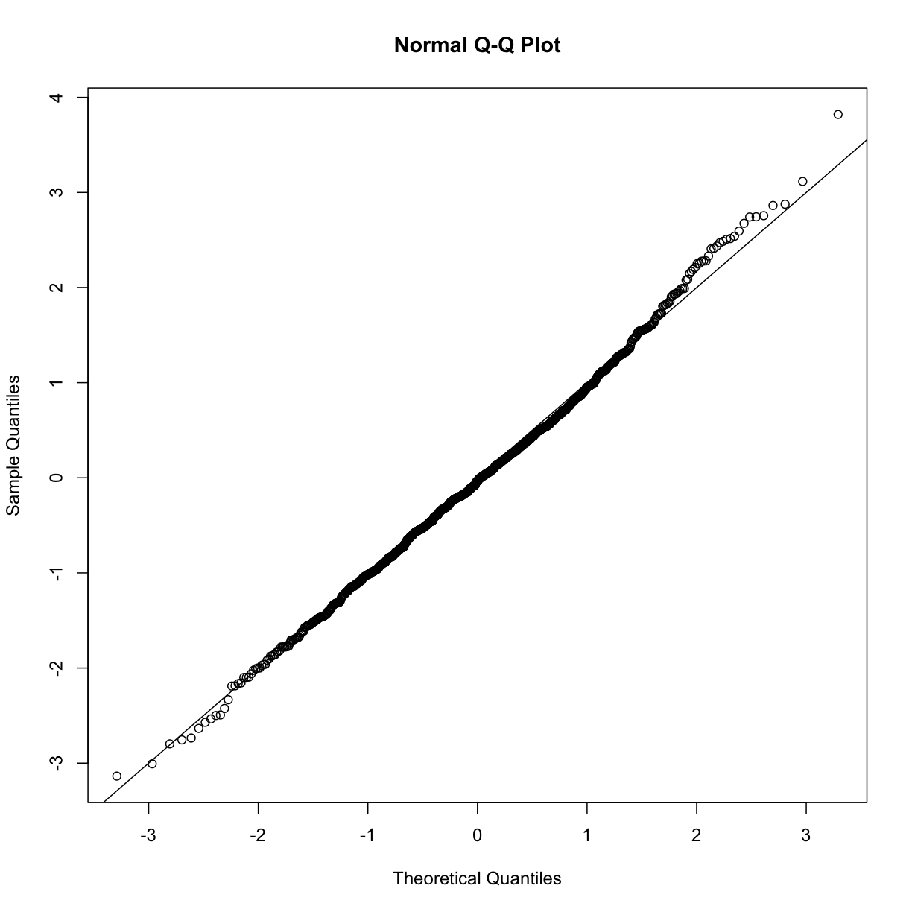
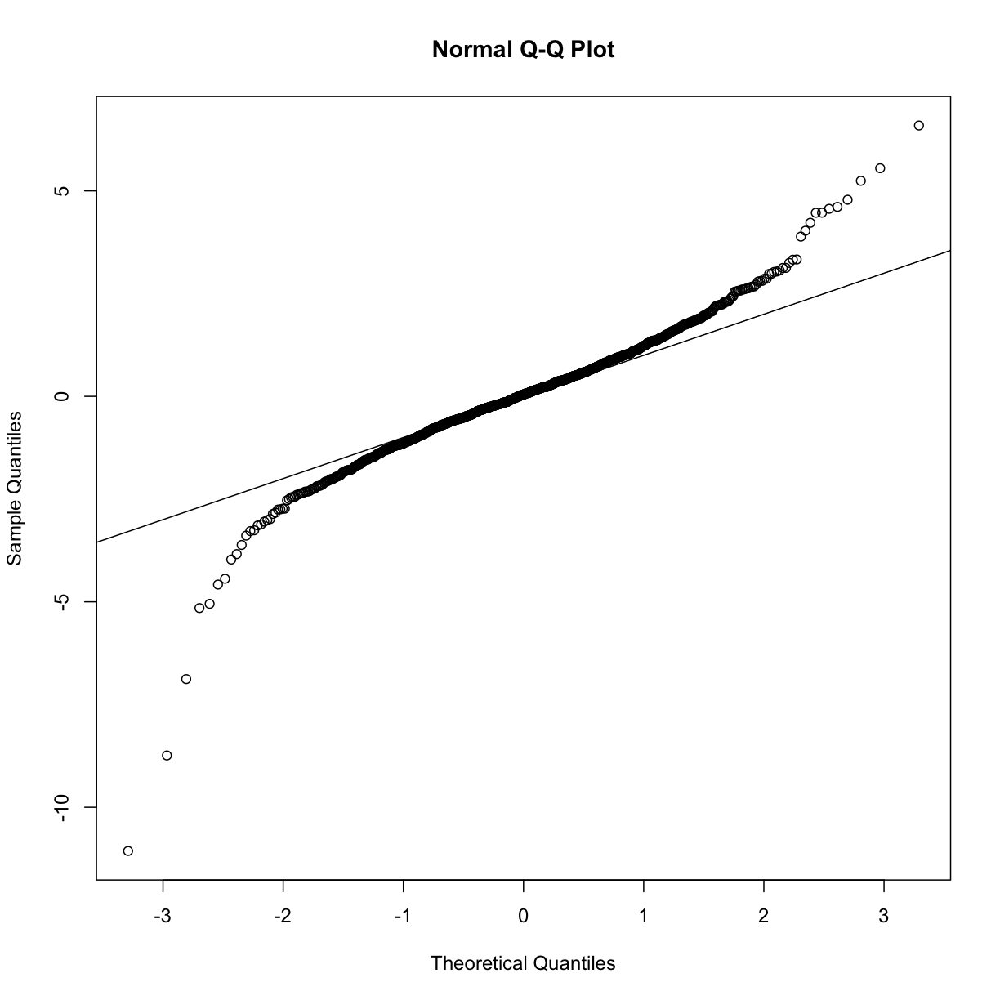
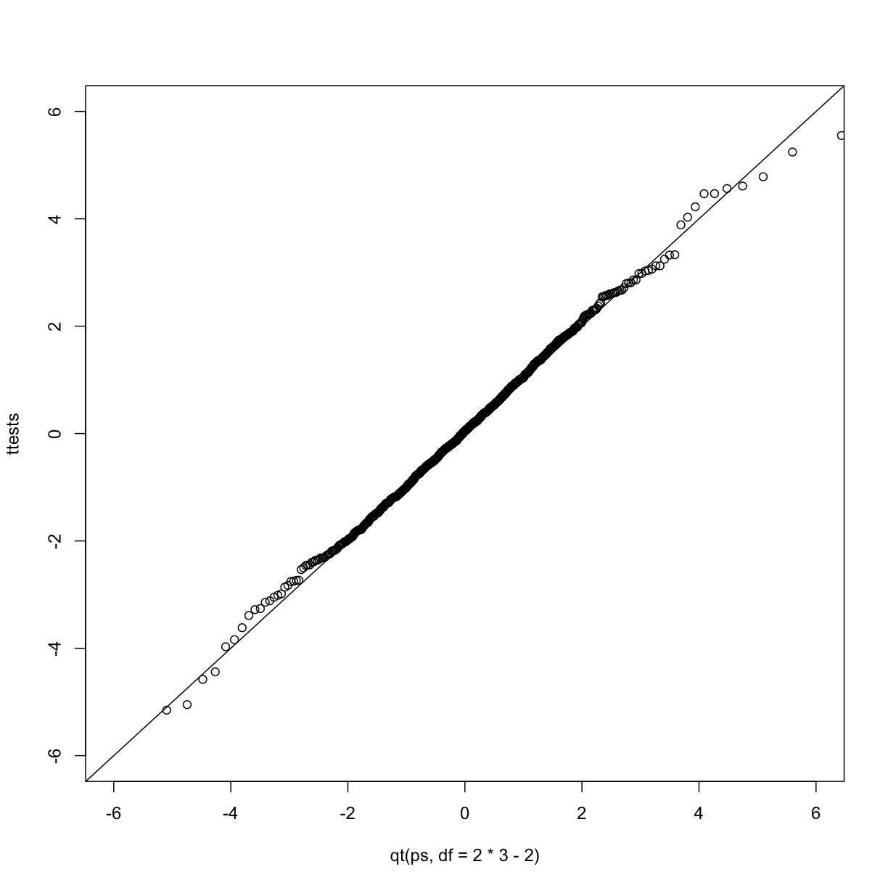
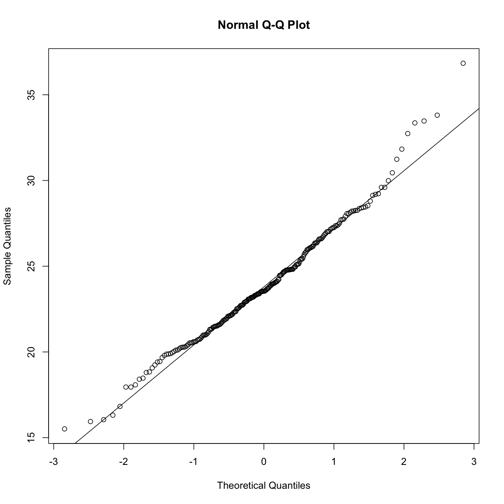

---
# Please do not edit this file directly; it is auto generated.
# Instead, please edit 09-inference-montecarlo.md in _episodes_rmd/
title: "Monte Carlo simulation"
teaching: 0
exercises: 0
questions:
- "How are Monte Carlo simulations used in practice?"
objectives:
- ""
- ""
- ""
keypoints:
- "."
- "."
- "."
- "."
source: Rmd
---

## Monte Carlo Simulation

Computers can be used to generate pseudo-random numbers. For practical purposes these pseudo-random numbers can be used to imitate random variables from the real world. This permits us to examine properties of random variables using a computer instead of theoretical or analytical derivations. One very useful aspect of this concept is that we can create *simulated* data to test out ideas or competing methods, without actually having to perform laboratory experiments.

Simulations can also be used to check theoretical or analytical results. Also, many of the theoretical results we use in statistics are based on asymptotics: they hold when the sample size goes to infinity. In practice, we never have an infinite number of samples so we may want to know how well the theory works with our actual sample size. Sometimes we can answer this question analytically, but not always. Simulations are extremely useful in these cases.

As an example, let's use a Monte Carlo simulation to compare the CLT to the t-distribution approximation for different sample sizes.

~~~
library(dplyr)
dat <- read.csv("mice_pheno.csv")
controlPopulation <- filter(dat,Sex == "F" & Diet == "chow") %>%  
  select(Bodyweight) %>% unlist
~~~
{: .language-r}

We will build a function that automatically generates a t-statistic under the null hypothesis for a sample size of `n`.

~~~
ttestgenerator <- function(n) {
  #note that here we have a false "high fat" group where we actually
  #sample from the chow or control population. 
  #This is because we are modeling the null.
  cases <- sample(controlPopulation,n)
  controls <- sample(controlPopulation,n)
  tstat <- (mean(cases)-mean(controls)) / 
      sqrt( var(cases)/n + var(controls)/n ) 
  return(tstat)
  }
ttests <- replicate(1000, ttestgenerator(10))
~~~
{: .language-r}

With 1,000 Monte Carlo simulated occurrences of this random variable, we can now get a glimpse of its distribution:

~~~
hist(ttests)
~~~
{: .language-r}

So is the distribution of this t-statistic well approximated by the
normal distribution? In the next chapter, we will formally introduce
quantile-quantile plots, which provide a useful visual inspection of
how well one distribution approximates another. As we will explain
later, if points fall on the identity line, it means the approximation
is a good one. 

~~~
qqnorm(ttests)
abline(0,1)
~~~
{: .language-r}

This looks like a very good approximation. For this particular population, a sample size of 10 was large enough to use the CLT approximation. How about 3? 

~~~
ttests <- replicate(1000, ttestgenerator(3))
qqnorm(ttests)
abline(0,1)
~~~
{: .language-r}

Now we see that the large quantiles, referred to by statisticians as
the _tails_, are larger than expected (below the line on the left side
of the plot and above the line on the right side of the plot).  In the
previous module, we explained that when the sample size is not large
enough and the *population values* follow a normal distribution, then
the t-distribution is a better approximation. Our simulation results
seem to confirm this:

~~~
ps <- (seq(0,999)+0.5)/1000
qqplot(qt(ps,df=2*3-2),ttests,xlim=c(-6,6),ylim=c(-6,6))
abline(0,1)
~~~
{: .language-r}

The t-distribution is a much better approximation in this case, but it is still not perfect. This is due to the fact that the original data is not that well approximated by the normal distribution.

~~~
qqnorm(controlPopulation)
qqline(controlPopulation)
~~~
{: .language-r}

## Parametric Simulations for the Observations

The technique we used to motivate random variables and the null
distribution was a type of Monte Carlo simulation. We had access to
population data and generated samples at random. In practice, we do
not have access to the entire population. The reason for using the
approach here was for educational purposes. However, when we want to
use Monte Carlo simulations in practice, it is much more typical to
assume a parametric distribution and generate a population from
this, which is called a _parametric simulation_. This means that we take
parameters estimated from the real data (here the mean and the standard
deviation), and plug these into a model (here the normal
distribution).  This is actually the most common form of Monte Carlo
simulation. 

For the case of weights, we could use our knowledge that mice typically weigh 24 grams with a SD of about 3.5 grams, and that the distribution is approximately normal, to generate population data:

~~~
controls<- rnorm(5000, mean=24, sd=3.5) 
~~~
{: .language-r}

After we generate the data, we can then repeat the exercise above. We no longer have to use the `sample` function since we can re-generate random normal numbers. The `ttestgenerator` function therefore can be written as follows: 

~~~
ttestgenerator <- function(n, mean=24, sd=3.5) {
  cases <- rnorm(n,mean,sd)
  controls <- rnorm(n,mean,sd)
  tstat <- (mean(cases)-mean(controls)) / 
      sqrt( var(cases)/n + var(controls)/n ) 
  return(tstat)
  }
~~~
{: .language-r}
ExercisesWe have used Monte Carlo simulation throughout this chapter to demonstrate statistical concepts;namely, sampling from the population. We mostly applied this to demonstrate the statisticalproperties related to inference on differences in averages. Here, we will consider examples of howMonte Carlo simulations are used in practice.1.Imagine you areWilliam_Sealy_Gossetand have just mathematically derived the distribu-tion of the t-statistic when the sample comes from a normal distribution. Unlike Gosset youhave access to computers and can use them to check the results.Let’s start by creating an outcome. Set the seed at 1, usernormto generate a random sampleof size 5,X1; : : : ; X5from a standard normal distribution, then compute the t-statistict=p5X/swithsthe sample standard deviation. What value do you observe?2.You have just performed a Monte Carlo simulation usingrnorm, a random number generatorfor normally distributed data. Gosset’s mathematical calculation tells us that this randomvariable follows a t-distribution withN�1degrees of freedom. Monte Carlo simulationscan be used to check the theory: we generate many outcomes and compare them to thetheoretical result. Set the seed to 1, generateB= 1000t-statistics as done in exercise 1.What percent are larger than 2?3.The answer to exercise 2 is very similar to the theoretical prediction:1-pt(2,df=4). We cancheck several such quantiles using theqqplotfunction.To obtain quantiles for the t-distribution we can generate percentiles from just above 0 tojust below 1:B=100; ps = seq(1/(B+1), 1-1/(B+1),len=B)and compute the quantileswithqt(ps,df=4). Now we can useqqplotto compare these theoretical quantiles to thoseobtained in the Monte Carlo simulation. Use Monte Carlo simulation developed for exercise2 to corroborate that the t-statistict=pNX/sfollows a t-distribution for several valuesofN.
For which sample sizes does the approximation best work?•A) Larger sample sizes.•B) Smaller sample sizes.•C) The approximations are spot on for all sample sizes.•D) None. We should use CLT instead.4.Use Monte Carlo simulation to corroborate that the t-statistic comparing two means andobtained with normally distributed (mean 0 and sd) data follows a t-distribution. In thiscase we will use thet.testfunction withvar.equal=TRUE. With this argument the degreesof freedom will bedf=2*N-2withNthe sample size. For which sample sizes does theapproximation best work?•A) Larger sample sizes.•B) Smaller sample sizes.•C) The approximations are spot on for all sample sizes.•D) None. We should use CLT instead.5.Is the following statement true or false? If instead of generating the sample withX=rnorm(15),we generate it with binary dataX=rbinom(n=15,size=1,prob=0.5)then the t-statistictstat<-sqrt(15)*mean(X)/sd(X)is approximated by a t-distribution with 14 degrees of freedom.6.Is the following statement true or false? If instead of generating the sample withX=rnorm(N)withN=500, we generate the data with binary dataX=rbinom(n=500,size=1,prob=0.5),then the t-statisticsqrt(N)*mean(X)/sd(X)is approximated by a t-distribution with 499degrees of freedom.7.We can derive approximation of the distribution of the sample average or the t-statistictheoretically. However, suppose we are interested in the distribution of a statistic for whicha theoretical approximation is not immediately obvious.Consider the sample median as an example. Use a Monte Carlo to determine which ofthe following best approximates the median of a sample taken from normally distributedpopulation with mean 0 and standard deviation 1.•A) Just like for the average, the sample median is approximately normal with mean 0and SD1/pN.•B) The sample median is not approximately normal.•C) The sample median is t-distributed for small samples and normally distributed forlarge ones.•D) The sample median is approximately normal with mean 0 and SD larger than1/pN.
