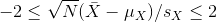

```{r, include=FALSE}
source("../bin/chunk-options.R")
knitr_fig_path("03-")
library(downloader)
url <- "https://raw.githubusercontent.com/genomicsclass/dagdata/master/inst/extdata/mice_pheno.csv"
filename <- basename(url)
download(url, destfile=filename)
pheno <- na.omit(read.csv(filename))
library(tidyverse)
library(rafalib)
```

## Populations, Samples and Estimates 
We can never know the true mean or variance of an entire population. Why not? Because we can't feasibly measure every member of a population. We can never know the true mean blood pressure of all mice, for example, even if all are from one strain, because we can't afford to buy them all or even find them all. We can never know the true mean blood pressure of all people on a Western diet, for example, because we can't possible measure the entire population that's on a Western diet. If we could measure all people on a Western diet, we really are interested in the difference in means between people on a Western vs. non high fat high sugar diet because we want to know what effect the diet has on people. If there is no difference in means, we can say that there is no effect of diet. If there is a difference in means, we can say that the diet has an effect. 
The question we are asking is can be expressed as:

Is


[example of normal curves]("https://www.varsitytutors.com/assets/vt-hotmath-legacy/hotmath_help/topics/normal-distribution-of-data/normal-distribution-1.gif")

We also want to know the variance from the mean, so that we have a sense of the spread of measurement around the mean.

In reality we use sample estimates of population parameters. The true population parameters that we are interested in are mean and standard deviation. Here we learn how to taking a sample permits us to answer our questions about differences between groups. This is the essence of statistical inference.

Now that we have introduced the idea of a random variable, a null distribution, and a p-value, we are ready to describe the mathematical theory that permits us to compute p-values in practice. We will also learn about confidence intervals and power calculations.

#### Population parameters

A first step in statistical inference is to understand what population
you are interested in. In the mouse weight example, we have two
populations: female mice on control diets and female mice on high fat
diets, with weight being the outcome of interest. We consider this
population to be fixed, and the randomness comes from the
sampling. One reason we have been using this dataset as an example is
because we happen to have the weights of all the mice of this
type. We download [this](https://raw.githubusercontent.com/genomicsclass/dagdata/master/inst/extdata/mice_pheno.csv) file to our working directory and read in to R:

```{r load_pheno}
pheno <- read.csv(file = "../data/mice_pheno.csv")
```

We can then access the population values and determine, for example, how many we have. Here we compute the size of the control population:

```{r control_pop, message=FALSE}
controlPopulation <- filter(pheno, Sex == "F" & Diet == "chow") %>%
  select(Bodyweight) %>% unlist
length(controlPopulation)
```

We usually denote these values as <i>x<sub> 1</sub>,...,x<sub>m</sub></i>. In this case, *m* is the number computed above. We can do the same for the high fat diet population:

```{r hf_pop}
hfPopulation <- filter(pheno, Sex == "F" & Diet == "hf") %>%  
  select(Bodyweight) %>% unlist
length(hfPopulation)
```

and denote with <i>y<sub> 1</sub>,...,y<sub>n</sub></i>.

We can then define summaries of interest for these populations, such as the mean and variance. 

The mean:


```{r mu_control_vs_hf}
# X is the control population
sum(controlPopulation) # sum of the xsubi's
length(controlPopulation) # this equals m
sum(controlPopulation)/length(controlPopulation) # this equals mu sub x


# Y is the high fat diet population
sum(hfPopulation) # sum of the ysubi's
sum(hfPopulation)/length(hfPopulation) # this equals mu sub y
```

The variance:


with the standard deviation being the square root of the variance. We refer to such quantities that can be obtained from the population as *population parameters*. The question we started out asking can now be written mathematically: is <i>&mu;<sub>Y</sub> - &mu;<sub>X</sub> = 0</i> ? 
Although in our illustration we have all the values and can check if this is true, in practice we do not. For example, in practice it would be prohibitively expensive to buy all the mice in a population. Here we learn how taking a *sample* permits us to answer our questions. This is the essence of statistical inference.

#### Sample estimates
In the previous chapter, we obtained samples of 12 mice from each
population. We represent data from samples with capital letters to
indicate that they are random. This is common practice in statistics,
although it is not always followed. So the samples are <i>X<sub> 1</sub>,...,X<sub>M</sub></i> and <i>Y<sub> 1</sub>,...,Y<sub>N</sub></i> and, in this case, <i>&Nu;=&Mu;=12</i>. In contrast and as we saw above, when we list out the values of the population, which are set and not random, we use lower-case letters.

Since we want to know if <i>&mu;<sub>Y</sub> - &mu;<sub>X</sub> = 0</i>,
we consider the sample version: <i>Y&#772;-X&#772;</i> with:

 


Note that this difference of averages is also a random variable.
Previously, we learned about the behavior of random variables
with an exercise that involved repeatedly sampling from the original
distribution. Of course, this is not an exercise that we can execute
in practice. In this particular case it would involve buying 24 mice
over and over again. Here we described the mathematical theory that
mathematically relates <i>X&#772;</i> to <i>&mu;<sub>X</sub></i>
and <i>Y&#772;</i> to <i>&mu;<sub>Y</sub></i>,
that will in turn help us understand the relationship between
<i>Y&#772;-X&#772;</i> and <i>&mu;<sub>Y</sub> - &mu;<sub>X</sub></i>. 
Specifically, we will describe how the Central Limit Theorem permits us to use an approximation to
answer this question, as well as motivate the widely used t-distribution.


> ## Exercise 1  
> We will use the mouse phenotype data. Remove the lines that contain missing values:  
> `{r na_omit_pheno}`  
> `pheno <- na.omit(pheno)`  
> 1. Use `dplyr` to create a vector `x` with the body weight of all males on the control (chow) diet.   
> What is this population’s average?  
> 2. Now use the `rafalib` package and use the `popsd` function to compute the population standard deviation.  
> 3. Set the seed at 1. Take a random sample `X` of size 25 from `x`. What is the sample average?  
> 4. Use `dplyr` to create a vector `y` with the body weight of all males on the high fat (hf) diet.  
> What is this population’s average?  
> 5. Now use the `rafalib` package and use the `popsd` function to compute the population standard deviation.  
> 6. Set the seed at 1. Take a random sample `Y` of size 25 from `y`. What is the sample average?  
> 7. What is the difference in absolute value between <i>y&#772;-x&#772;</i> and <i>X&#772;-Y&#772;</i>?  
> 8. Repeat the above for females. Make sure to set the seed to 1 before each sample call. What is the difference 
> in absolute value between <i>y&#772;-x&#772;</i> and <i>X&#772;-Y&#772;</i>?  
> 9. For the females, our sample estimates were closer to the population difference than with males. 
> What is a possible explanation for this?  
> A) The population variance of the females is smaller than that of the males; thus, the sample variable has less variability.  
> B) Statistical estimates are more precise for females.  
> C) The sample size was larger for females.  
> D) The sample size was smaller for females.
>
> > ## Solution to Exercise 1
> >
> {: .solution}
{: .challenge}

## Central Limit Theorem and t-distribution
Below we will discuss the Central Limit Theorem (CLT) and the t-distribution, both of which help us make important calculations related to probabilities. Both are frequently used in science to test statistical hypotheses. To use these, we have to make different assumptions from those for the CLT and the t-distribution. However, if the assumptions are true, then we are able to calculate the exact probabilities of events through the use of mathematical formula.

#### Central Limit Theorem 

The CLT is one of the most frequently used mathematical results in science. It tells us that when the sample size is large, the average Y&#772; of a random sample follows a normal distribution centered at the population average &mu;<sub>Y</sub> and with standard deviation equal to the population standard deviation &sigma;<sub>Y</sub>, divided by the square root of the sample size *N*. We refer to the standard deviation of the distribution of a random variable as the random variable's *standard error*.

This implies that if we take many samples of size *N*, then the quantity: 


is approximated with a normal distribution centered at 0 and with standard deviation 1.

We are interested in the difference between two sample averages. Again, applying certain mathematical principles, it can be implied that the below ratio:  


is approximated by a normal distribution centered at 0 and standard deviation 1. Calculating p-values for the standard normal distribution is simple because we know the proportion of the distribution under any value. For example, only 5% of the values in the standard normal distribution are larger than 2 (in absolute value):

```{r calc_pvalue}
pnorm(-2) + (1 - pnorm(2))
```

We don't need to buy more mice, 12 and 12 suffice.

However, we can't claim victory just yet because we don't know the population standard deviations: &sigma;<sub>X</sub> and &sigma;<sub>Y</sub>. These are unknown population parameters, but we can get around this by using the sample standard deviations, call them *s<sub>X</sub>* and *s<sub>Y</sub>*. These are defined as: 


Note that we are dividing by *M-1* and *N-1*, instead of by *M* and *N*. There is a theoretical reason for doing this which we do not explain here.

So we can redefine our ratio as


if *M = N* or in general,


The CLT tells us that when *M* and *N* are large, this random variable is normally distributed with mean 0 and SD 1. Thus we can compute p-values using the function `pnorm`.

#### The t-distribution

The CLT relies on large samples, what we refer to as *asymptotic results*. When the CLT does not apply, there is another option that does not rely on asymptotic results. When the original population from which a random variable, say *Y*, is sampled is normally distributed with mean 0, then we can calculate the distribution of: 


This is the ratio of two random variables so it is not
necessarily normal. The fact that the denominator can be small by
chance increases the probability of observing large
values. [William Sealy Gosset](http://en.wikipedia.org/wiki/William_Sealy_Gosset),
an employee of the Guinness brewing company, deciphered the
distribution of this random variable and published a paper under the
pseudonym "Student". The distribution is therefore called Student's
t-distribution. Later we will learn more about how this result is
used.

> ## Exercise 2  
> 1. If a list of numbers has a distribution that is well approximated
> by the normal distribution, what proportion of these numbers are
> within one standard deviation away from the list’s average?  
> 2. What proportion of these numbers are within two standard
> deviations away from the list’s average?  
> 3. What proportion of these numbers are within three standard
> deviations away from the list’s average?  
> 4. Define y to be the weights of males on the control diet. 
> What proportion of the mice are within one standard deviation away
> from the average weight (remember to use `popsd` for the
> population sd)?  
> 5. What proportion of these numbers are within two standard deviations
> away from the list’s average?  
> 6. What proportion of these numbers are within three standard
> deviations away from the list’s average?  
> 7. Note that the numbers for the normal distribution and our weights
> are relatively close. Also, notice that we are indirectly comparing
> quantiles of the normal distribution to quantiles of the mouse weight
> distribution. We can actually compare all quantiles using a
> qqplot. Which of the following best describes the qq-plot comparing
> mouse weights to the normal distribution?  
> A) The points on the qq-plot fall exactly on the identity line.  
> B) The average of the mouse weights is not 0 and thus it can’t follow a normal distribution.  
> C) The mouse weights are well approximated by the normal
> distribution, although the larger values (right tail) are larger than
> predicted by the normal. This is consistent with the differences seen
> between question 3 and 6.  
> D) These are not random variables and thus they can’t follow a normal distribution.  
> 8. Create the above qq-plot for the four populations: male/females on
> each of the two diets. What is the most likely explanation for the
> mouse weights being well approximated?   
> What is the best explanation for all these being well approximated by
> the normal distribution?  
> A) The CLT tells us that sample averages are approximately normal.  
> B) This just happens to be how nature behaves, perhaps the result of
> many biological factors averaging out.  
> C) Everything measured in nature follows a normal distribution.  
> D) Measurement error is normally distributed.
>
> > ## Solution to Exercise 2
> {: .solution}
{: .challenge}

> ## Exercise 3
> Here we are going to use the function `replicate` to learn about
> the distribution of random variables. All the above exercises relate
> to the normal distribution as an approximation of the distribution of
> a fixed list of numbers or a population. We have not yet discussed
> probability in these exercises. If the distribution of a list of  numbers
> is approximately normal, then if we pick a number at random from this
> distribution, it will follow a normal distribution. However, it is
> important to remember that stating that some quantity has a
> distribution does not necessarily imply this quantity is random.
> Also, keep in mind that this is not related to the central limit
> theorem. The central limit applies to averages of random variables.
> Let’s explore this concept.  
> We will now take a sample of size 25 from the population of males on the chow diet. 
> The average of this sample is our random variable. We will use the replicate to observe
> 10,000 realizations of this random variable.  
> 1. Set the seed at 1, generate these 10,000 averages.  
> `set.seed(1)`  
> `y <- filter(pheno, Sex=="M"&Diet=="chow") %>%`   
> `select(Bodyweight) %>%`   
> `unlist`  
> `avgs <- replicate(10000, mean(sample(y,25)))`   
> 2. Make a histogram and qq-plot these 10,000 numbers against the normal distribution. 
> `mypar(1,2)`  
> `hist(avgs)`  
> `qqnorm(avgs)`  
> `qqline(avgs)`  
> We can see that, as predicted by the CLT, the distribution of the
> random variable is very well approximated by the normal distribution.  
> 3. What is the average of the distribution of the sample average?  
> 4. What is the standard deviation of the distribution of sample averages?  
> According to the CLT, the answer to the exercise above should be the
> same as `mean(y)`. You should be able to confirm that these two
> numbers are very close. 
> 5. Which of the following does the CLT tell us
> should be close to your answer to this exercise?  
> A) `popsd(y)`  
> B) `popsd(avgs)/sqrt(25)`  
> C) `sqrt(25) / popsd(y)`  
> D) `popsd(y)/sqrt(25)`
>
> > ## Solution to Exercise 3
> {: .solution}
{: .challenge}

## t-tests in Practice

#### Introduction

We will now demonstrate how to obtain a p-value in practice. We begin by loading experimental data and walking you through the steps used to form a t-statistic and compute a p-value. We can perform this task with just a few lines of code (go to the end of this section to see them). However, to understand the concepts, we will construct a t-statistic from "scratch".


#### Read in and prepare data

We start by reading in the data. A first important step is to identify which rows are associated with treatment and control, and to compute the difference in mean. 

```{r chow_hf, message=FALSE}
control <- filter(pheno, Diet=="chow") %>%
  select(Bodyweight) %>% 
  unlist
treatment <- filter(pheno, Diet=="hf") %>%
  select(Bodyweight) %>% 
  unlist
diff <- mean(treatment) - mean(control)
print(diff)
```

We are asked to report a p-value. What do we do? We learned that
`diff`, referred to as the _observed effect size_, is a random
variable. We also learned that under the null hypothesis, the mean of the distribution of `diff` is 0. What about the standard error? We also learned that the standard error of this random variable is the population standard deviation divided by the square root of the sample size:


We use the sample standard deviation as an estimate of the population
standard deviation. In R, we simply use the `sd` function and the SE is:

```{r}
sd(control)/sqrt(length(control))
```

This is the SE of the sample average, but we actually want the SE of `diff`. We saw how statistical theory tells us that the variance of the difference of two random variables is the sum of its variances, so we compute the variance and take the square root:

```{r stderr}
se <- sqrt( 
  var(treatment)/length(treatment) + 
  var(control)/length(control) 
  )
```

Statistical theory tells us that if we divide a random variable by its SE, we get a new random variable with an SE of 1.

```{r}
tstat <- diff/se 
```

This ratio is what we call the t-statistic. It's the ratio of two random variables and thus a random variable. Once we know the distribution of this random variable, we can then easily compute a p-value.

As explained in the previous section, the CLT tells us that for large sample sizes, both sample averages `mean(treatment)` and `mean(control)` are normal. Statistical theory tells us that the difference of two normally distributed random variables is again normal, so CLT tells us that `tstat` is approximately normal with mean 0 (the null hypothesis) and SD 1 (we divided by its SE). 

So now to calculate a p-value all we need to do is ask: how often does
a normally distributed random variable exceed `diff`? R has a built-in
function, `pnorm`, to answer this specific question. `pnorm(a)` returns
the probability that a random variable following the standard normal
distribution falls below `a`. To obtain the probability that it is
larger than `a`, we simply use `1-pnorm(a)`. We want to know the
probability of seeing something as extreme as `diff`: either smaller
(more negative) than `-abs(diff)` or larger than `abs(diff)`. We call
these two regions "tails" and calculate their size:

```{r tails}
righttail <- 1 - pnorm(abs(tstat)) 
lefttail <- pnorm(-abs(tstat))
pval <- lefttail + righttail
print(pval)
```

In this case, the p-value is smaller than 0.05 and using the conventional cutoff of 0.05, we would call the difference _statistically significant_.

Now there is a problem. CLT works for large samples, but is 12 large enough? A rule of thumb for CLT is that 30 is a large enough sample size (but this is just a rule of thumb). The p-value we computed is only a valid approximation if the assumptions hold, which do not seem to be the case here. However, there is another option other than using CLT.

<a name="smallsample"></a>

## The t-distribution in Practice

As described earlier, statistical theory offers another useful
result. If the distribution of the population is normal, then we can
work out the exact distribution of the t-statistic without the need
for the CLT. This is a big "if" given that, with small
samples, it is hard to check if the population is normal. But for
something like weight, we suspect that the population distribution is
likely well approximated by normal and that we can use this
approximation. Furthermore, we can look at a qq-plot for the
samples. This shows that the approximation is at least close: 

```{r data_qqplot, fig.cap="Quantile-quantile plots for sample against theoretical normal distribution.", fig.width=10.5,fig.height=5.25}
library(rafalib)
mypar(1,2)
qqnorm(treatment)
qqline(treatment,col=2)
qqnorm(control)
qqline(control,col=2)
```

If we use this approximation, then statistical theory tells us that
the distribution of the random variable `tstat` follows a
t-distribution. This is a much more complicated distribution than the
normal. The t-distribution has a location parameter like the normal
and another parameter called *degrees of freedom*. R has a nice
function that actually computes everything for us. 

```{r t_test}
t.test(treatment, control)
```

To see just the p-value, we can use the `$` extractor:

```{r ttest_result}
result <- t.test(treatment,control)
result$p.value
```

The p-value is slightly bigger now. This is to be expected because our
CLT approximation considered the denominator of `tstat` practically
fixed (with large samples it practically is), while the t-distribution
approximation takes into account that the denominator (the standard
error of the difference) is a random variable. The smaller the
sample size, the more the denominator varies. 

It may be confusing that one approximation gave us one p-value and another gave us another, because we expect there to be just one answer. However, this is not uncommon in data analysis. We used different assumptions, different approximations, and therefore we obtained different results.

Later, in the power calculation section, we will describe type I and
type II errors. As a preview, we will point out that the test based on
the CLT approximation is more likely to incorrectly reject the null
hypothesis (a false positive), while the t-distribution is more likely
to incorrectly accept the null hypothesis (false negative).

#### Running the t-test in practice

Now that we have gone over the concepts, we can show the relatively
simple code that one would use to actually compute a t-test: 

```{r ttest_pheno, message=FALSE}
control <- filter(pheno, Diet=="chow") %>%
  select(Bodyweight) %>% 
  unlist
treatment <- filter(pheno, Diet=="hf") %>%
  select(Bodyweight) %>% 
  unlist
t.test(treatment, control)
```

The arguments to `t.test` can be of type *data.frame* and thus we do not need to unlist them into numeric objects.

## Confidence Intervals

We have described how to compute p-values which are ubiquitous in the
life sciences. However, we do not recommend reporting p-values as the
only statistical summary of your results. The reason is simple:
statistical significance does not guarantee scientific
significance. With large enough sample sizes, one might detect a
statistically significance difference in weight of, say, 1
microgram. But is this an important finding? Would we say a diet
results in higher weight if the increase is less than a fraction of a
percent? The problem with reporting only p-values is that you will not
provide a very important piece of information: the effect size. Recall
that the effect size is the observed difference. Sometimes the effect
size is divided by the mean of the control group and so expressed as a
percent increase. 

A much more attractive alternative is to report confidence
intervals. A confidence interval includes information about your
estimated effect size and the uncertainty associated with this
estimate. Here we use the mice data to illustrate the concept behind
confidence intervals. 

#### Confidence Interval for Population Mean

Before we show how to construct a confidence interval for the
difference between the two groups, we will
show how to construct a confidence interval for the
population mean of control female mice.
Then we will return to the group difference after we've learned how to build
confidence intervals in the simple case.
We start by reading in the data and selecting the appropriate rows:

```{r chowPop}
chowPopulation <- pheno %>% 
  filter(Sex=="F" & Diet=="chow") %>% 
  select(Bodyweight) %>% 
  unlist
```

The population average <i>&mu;<sub>X</sub></i> is our parameter of interest here:

```{r muChow}
mu_chow <- mean(chowPopulation)
print(mu_chow)
```

We are interested in estimating this parameter. In practice, we do not get to see the entire population so, as we did for p-values, we demonstrate how we can use samples to do this. Let's start with a sample of size 30:

```{r sampleChow}
N <- 30
chow <- sample(chowPopulation, N)
print(mean(chow))
```

We know this is a random variable, so the sample average will not be a perfect estimate. In fact, because in this illustrative example we know the value of the parameter, we can see that they are not exactly the same. A confidence interval is a statistical way of reporting our finding, the sample average, in a way that explicitly summarizes the variability of our random variable.

With a sample size of 30, we will use the CLT. The CLT tells us that <i>X&#772;</i> or `mean(chow)` follows a normal distribution with mean <i>&mu;<sub>X</sub></i> or `mean(chowPopulation)` and standard error approximately  <i>s<sub>X</sub> /  &radic;N</i> or:

```{r}
se <- sd(chow)/sqrt(N)
print(se)
```

<a name="interval"></a>

#### Defining the Interval

A 95% confidence interval (we can use percentages other than 95%) is a
random interval with a 95% probability of falling on the parameter we
are estimating. Keep in mind that saying 95% of random intervals will fall on the
true value (our definition above) is *not the same* as saying there is
a 95% chance that the true value falls in our interval. 
To construct it, we note that the CLT tells us that 
<i>&radic;N (X&#772;-<i>&mu;<sub>X</sub></i>) / s<sub>X</sub></i> follows a normal distribution with mean 0 and
SD 1. This implies that the probability of this event:



which written in R code is:

```{r conf_int}
pnorm(2) - pnorm(-2)
```

...is about 95% (to get closer use `qnorm(1 - 0.05/2)` instead of
2). Now do some basic algebra to clear out everything and leave
<i>&mu;<sub>X</sub></i> alone in the middle and you get that the following event: 


 
has a probability of 95%. 

Be aware that it is the edges of the interval 
<i>X&#772;- &plusmn; 2 s<sub>X</sub> / &radic;N</i>, not <i>&mu;<sub>X</sub></i>, 
that are random. Again, the definition of
the confidence interval is that 95% of *random intervals* will contain
the true, fixed value <i>&mu;<sub>X</sub></i>. For a specific interval that has been
calculated, the probability is either 0 or 1 that it contains the
fixed population mean <i>&mu;<sub>X</sub></i>.

Let's demonstrate this logic through simulation. We can construct this
interval with R relatively easily: 

```{r const_conf_int}
Q <- qnorm(1 - 0.05/2)
interval <- c(mean(chow)-Q*se, mean(chow)+Q*se )
interval
interval[1] < mu_chow & interval[2] > mu_chow
```

which happens to cover <i>&mu;<sub>X</sub></i> or `mean(chowPopulation)`. However, we can take another sample and we might not be as lucky. In fact, the theory tells us that we will cover <i>&mu;<sub>X</sub></i> 95% of the time. Because we have access to the population data, we can confirm this by taking several new samples:

```{r confidence_interval_n30,fig.cap="We show 250 random realizations of 95% confidence intervals. The color denotes if the interval fell on the parameter or not.",fig.height=8}
library(rafalib)
B <- 250
mypar()
plot(mean(chowPopulation)+c(-7,7),c(1,1),type="n",
     xlab="weight",ylab="interval",ylim=c(1,B))
abline(v=mean(chowPopulation))
for (i in 1:B) {
  chow <- sample(chowPopulation,N)
  se <- sd(chow)/sqrt(N)
  interval <- c(mean(chow)-Q*se, mean(chow)+Q*se)
  covered <- 
    mean(chowPopulation) <= interval[2] & mean(chowPopulation) >= interval[1]
  color <- ifelse(covered,1,2)
  lines(interval, c(i,i),col=color)
}
```

You can run this repeatedly to see what happens. You will see that in about 5% of the cases, we fail to cover <i>&mu;<sub>X</sub></i>.

<a name="smallsample"></a>

#### Small Sample Size and the CLT

For *N=30*, the CLT works very well. However, if *N=5*, do these confidence intervals work as well? We used the CLT to create our intervals, and with *N=5* it may not be as useful an approximation. We can confirm this with a simulation:


```{r confidence_interval_n5,fig.cap="We show 250 random realizations of 95% confidence intervals, but now for a smaller sample size. The confidence interval is based on the CLT approximation. The color denotes if the interval fell on the parameter or not.",fig.height=8}
mypar()
plot(mean(chowPopulation)+c(-7,7),c(1,1),type="n",
     xlab="weight",ylab="interval",ylim=c(1,B))
abline(v=mean(chowPopulation))
Q <- qnorm(1- 0.05/2)
N <- 5
for (i in 1:B) {
  chow <- sample(chowPopulation,N)
  se <- sd(chow)/sqrt(N)
  interval <- c(mean(chow)-Q*se, mean(chow)+Q*se)
  covered <- mean(chowPopulation) <= interval[2] & mean(chowPopulation) >= interval[1]
  color <- ifelse(covered,1,2)
  lines(interval, c(i,i),col=color)
}
```

Despite the intervals being larger (we are dividing by <i>&radic;5</i>
instead of <i>&radic;30</i> ), we see many more intervals not covering
<i>&mu;<sub>X</sub></i>. This is because the CLT is incorrectly telling us that the
distribution of the `mean(chow)` is approximately normal with standard deviation 1 when, in fact,
it has a larger standard deviation and a fatter tail (the parts of the distribution going to
<i>&plusmn; &infin;</i>). This mistake affects us in the calculation of `Q`, which assumes a normal distribution and uses `qnorm`. The t-distribution might be more appropriate. All we have to do is re-run the above, but change how we calculate `Q` to use `qt` instead of `qnorm`.

```{r confidence_interval_tdist_n5,fig.cap="We show 250 random realizations of 95% confidence intervals, but now for a smaller sample size. The confidence is now based on the t-distribution approximation. The color denotes if the interval fell on the parameter or not.",fig.height=8}
mypar()
plot(mean(chowPopulation) + c(-7,7), c(1,1), type="n",
     xlab="weight", ylab="interval", ylim=c(1,B))
abline(v=mean(chowPopulation))
##Q <- qnorm(1- 0.05/2) ##no longer normal so use:
Q <- qt(1- 0.05/2, df=4)
N <- 5
for (i in 1:B) {
  chow <- sample(chowPopulation, N)
  se <- sd(chow)/sqrt(N)
  interval <- c(mean(chow)-Q*se, mean(chow)+Q*se )
  covered <- mean(chowPopulation) <= interval[2] & mean(chowPopulation) >= interval[1]
  color <- ifelse(covered,1,2)
  lines(interval, c(i,i),col=color)
}
```

Now the intervals are made bigger. This is because the t-distribution has fatter tails and therefore:

```{r}
qt(1- 0.05/2, df=4)
```

is bigger than...

```{r}
qnorm(1- 0.05/2)
```

...which makes the intervals larger and hence cover <i>&mu;<sub>X</sub></i> more frequently; in fact, about 95% of the time.

#### Connection Between Confidence Intervals and p-values

We recommend that in practice confidence intervals be reported instead of p-values. If for some reason you are required to provide p-values, or required that your results are significant at the 0.05 of 0.01 levels, confidence intervals do provide this information. 

If we are talking about a t-test p-value, we are asking if 
differences as extreme as the one we observe, <i>Y&#772; - X&#772;</i>, are likely when the difference between the population averages is actually equal to
zero. So we can form a confidence interval with the observed 
difference. Instead of writing <i>Y&#772; - X&#772;</i> repeatedly, let's
define this difference as a new variable 
<i>d &equiv; Y&#772; - X&#772;</i>. 

Suppose you use CLT and report <i>d &plusmn; 2 s<sub>d</sub> / &radic;N</i>, with <i>s<sub>d</sub> = &radic;{s<sub>X</sub>^2 + s<sub>Y</sub>^2}</i>, as a
95% confidence interval for the difference and this interval does not
include 0 (a false positive).
Because the interval does not include 0, this implies that either
<i>D - 2 s<sub>d</sub> / &radic;N  > 0</i> or <i>d + 2 s<sub>d</sub>/&radic;N < 0</i>.
This suggests that either
<i>&radic;Nd/s<sub>d</sub> > 2</i> or <i>&radic;Nd/s<sub>d</sub> < 2</i>.  This
then implies that the t-statistic is more extreme than 2, which in
turn suggests that the p-value must be smaller than 0.05
(approximately, for a more exact calculation use `qnorm(.05/2)` instead of 2).
The same calculation can be made if we use the t-distribution instead of
CLT (with `qt(.05/2, df = 2 * N-2)`).
In summary, if a 95% or 99% confidence interval does not include
0, then the p-value must be smaller than 0.05 or 0.01 respectively. 

Note that the confidence interval for the difference *d* is provided by the `t.test` function:

```{r control_v_treatment,echo=FALSE}
controlIndex <- which(pheno$Diet=="chow")
treatmentIndex <- which(pheno$Diet=="hf")
control <- pheno[controlIndex, 3]
treatment <- pheno[treatmentIndex, 3]
```

```{r}
t.test(treatment, control)$conf.int
```

In this case, the 95% confidence interval does include 0 and we observe that the p-value is larger than 0.05 as predicted. If we change this to a 90% confidence interval, then:

```{r}
t.test(treatment,control,conf.level=0.9)$conf.int
```

0 is no longer in the confidence interval (which is expected because
the p-value is smaller than 0.10). 
