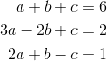
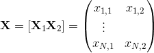
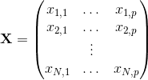

```{r, include=FALSE}
source("../bin/chunk-options.R")
knitr_fig_path("03-")
```

## Matrix Notation

Here we introduce the basics of matrix notation. Initially this may seem over-complicated, but once we discuss examples, you will appreciate the power of using this notation to both explain and derive solutions, as well as implement them as R code. 

#### The language of linear models

Linear algebra notation actually simplifies the mathematical descriptions and manipulations of linear models, as well as coding in R. We will discuss the basics of this notation and then show some examples in R.

The main point of this entire exercise is to show how we can write the models above using matrix notation, and then explain how this is useful for solving the least squares equation. We start by simply defining notation and matrix multiplication, but bear with us since we eventually get back to the practical application.

## Solving Systems of Equations

Linear algebra was created by mathematicians to solve systems of linear equations such as this:




$$
\begin{align*}
a + b + c &= 6\\
3a - 2b + c &= 2\\
2a + b  - c &= 1
\end{align*}
$$

It provides very useful machinery to solve these problems generally. We will learn how we can write and solve this system using matrix algebra notation:


$$ 
\,
\begin{pmatrix}
1&1&1\\
3&-2&1\\
2&1&-1
\end{pmatrix}
\begin{pmatrix}
a\\
b\\
c
\end{pmatrix} =
\begin{pmatrix}
6\\
2\\
1
\end{pmatrix}
\implies
\begin{pmatrix}
a\\
b\\
c
\end{pmatrix} =
\begin{pmatrix}
1&1&1\\
3&-2&1\\
2&1&-1
\end{pmatrix}^{-1}
\begin{pmatrix}
6\\
2\\
1
\end{pmatrix}
$$

This section explains the notation used above. It turns out that we can borrow this notation for linear models in statistics as well.

## Vectors, Matrices, and Scalars

In the falling object, father-son heights, and mouse weight examples, the random variables associated with the data were represented by <i>&Upsilon;<sub>i</sub>, ...,<i>&Upsilon;<sub>n</sub></i>. We can think of this as a vector. In fact, in R we are already doing this:

```{r,message=FALSE}
data(father.son,package="UsingR")
y=father.son$fheight
head(y)
```
In math we can also use just one symbol. We usually use bold to distinguish it from the individual entries:


For reasons that will soon become clear, default representation of data vectors have dimension <i>N x 1</i> as opposed to <i>1 x N</i>.

Here we don't always use bold because normally one can tell what is a matrix from the context.

Similarly, we can use math notation to represent the covariates or predictors. In a case with two predictors we can represent them like this:


Note that for the falling object example <i>x<sub>1,1</sub> = t<sub>i</sub></i> and <i>x<sub>i,1</sub> = t<sub>i</sub>i &sup2;</i> with <i>t<sub>i</sub></i> the time of the <i>i</i>-th observation. Also, keep in mind that vectors can be thought of as <i>N x 1</i> matrices.

For reasons that will soon become apparent, it is convenient to represent these in matrices:




$$ 
\mathbf{X} = [ \mathbf{X}_1 \mathbf{X}_2 ] = \begin{pmatrix}
x_{1,1}&x_{1,2}\\
\vdots\\
x_{N,1}&x_{N,2}
\end{pmatrix}
$$

This matrix has dimension <i>N x 2</i>. We can create this matrix in R this way:

```{r}
n <- 25
tt <- seq(0,3.4,len=n) ##time in secs, t is a base function
X <- cbind(X1=tt,X2=tt^2)
head(X)
dim(X)
```

We can also use this notation to denote an arbitrary number of covariates with the following <i>N x p</i> matrix:




$$
\mathbf{X} = \begin{pmatrix}
  x_{1,1}&\dots & x_{1,p} \\
  x_{2,1}&\dots & x_{2,p} \\
   & \vdots & \\
  x_{N,1}&\dots & x_{N,p} 
  \end{pmatrix}
$$

Just as an example, we show you how to make one in R now using `matrix` instead of `cbind`:

```{r}
N <- 100; p <- 5
X <- matrix(1:(N*p),N,p)
head(X)
dim(X)
```

By default, the matrices are filled column by column. The `byrow=TRUE` argument lets us change that to row by row:

```{r}
N <- 100; p <- 5
X <- matrix(1:(N*p),N,p,byrow=TRUE)
head(X)
```

Finally, we define a scalar. A scalar is just a number, which we call a scalar because we want to distinguish it from vectors and matrices. We usually use lower case and don't bold. In the next section, we will understand why we make this distinction.
