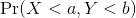
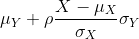
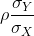
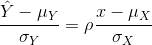

```{r load_libraries, include=FALSE}
source("../bin/chunk-options.R")
knitr_fig_path("12-")
```

```{r,include=FALSE}
set.seed(1)
```

# Exploratory Data Analysis

"The greatest value of a picture is when it forces us to notice what we never 
expected to see." -John W. Tukey

Biases, systematic errors and unexpected variability are common in
data from the life sciences. Failure to discover these problems often
leads to flawed analyses and false discoveries. As an example,
consider that experiments sometimes fail and not all data processing
pipelines, such as the `t.test` function in R, are designed to detect
these. Yet, these pipelines still give you an answer. Furthermore, it
may be hard or impossible to notice an error was made just from the
reported results. 

Graphing data is a powerful approach to detecting these problems. We
refer to this as *exploratory data analysis* (EDA). Many important
methodological contributions to existing techniques in
data analysis were initiated by discoveries made via EDA.
In addition, EDA can lead to interesting biological discoveries which
would otherwise be missed through simply subjecting the data to a
battery of hypothesis tests. Through this book, we make use of exploratory plots 
to motivate the analyses we choose. Here we present a general introduction to 
EDA using height data.

We have already introduced some EDA approaches for *univariate* data,
namely the histograms and qq-plot. Here we describe the qq-plot in more detail and
some EDA and summary statistics for paired data. We also give a
demonstration of commonly used figures that we recommend against. 

## Quantile Quantile Plots

To corroborate that a theoretical distribution, for example the normal 
distribution, is in fact a good approximation, we can use quantile-quantile plots
(qq-plots). Quantiles are best understood by considering the special
case of percentiles. The p-th percentile of a list of a distribution
is defined as the number q that is bigger than p% of numbers (so the inverse of
the cumulative distribution function we defined earlier). For
example, the median 50-th percentile is the median.
We can compute the percentiles for our list of heights:

```{r definingHeights, message=FALSE}
library(rafalib)
data(father.son,package="UsingR") ##available from CRAN
x <- father.son$fheight
```

and for the normal distribution:

```{r qqplot_example1, fig.cap="First example of qqplot. Here we compute the theoretical quantiles ourselves."}
ps <- ( seq(0,99) + 0.5 )/100 
qs <- quantile(x, ps)
normalqs <- qnorm(ps, mean(x), popsd(x))
plot(normalqs,qs,xlab="Normal percentiles",ylab="Height percentiles")
abline(0,1) ##identity line
```

Note how close these values are. Also, note that we can see these
qq-plots with less code (this plot has more points than the one we
constructed manually, and so tail-behavior can be seen more clearly).

```{r qqplot_example2, fig.cap="Second example of qqplot. Here we use the function qqnorm which computes the theoretical normal quantiles automatically."}
qqnorm(x)
qqline(x) 
```

However, the `qqnorm` function plots against a standard normal distribution. 
This is why the line has slope `popsd(x)` and intercept `mean(x)`.

In the example above, the points match the line very well. In fact, we can run 
Monte Carlo simulations to see plots like this for data known to be normally 
distributed.

```{r qqnorm_example, fig.cap="Example of the qqnorm function. Here we apply it to numbers generated to follow a normal distribution."}
n <-1000
x <- rnorm(n)
qqnorm(x)
qqline(x)
```

We can also get a sense for how non-normally distributed data will
look in a qq-plot. Here we generate data from the t-distribution with
different degrees of freedom. Notice that the smaller the degrees of
freedom, the fatter the tails. We call these "fat tails" because if we
plotted an empirical density or histogram, the density at the extremes would be
higher than the theoretical curve. In the qq-plot, this can be seen in
that the curve is lower than the identity line on the left
side and higher on the right side. This means that there are more
extreme values than predicted by the theoretical density plotted on
the x-axis.

```{r qqnorm_of_t, fig.cap="We generate t-distributed data for four degrees of freedom and make qqplots against normal theoretical quantiles.",fig.width=7.5,fig.height=7.5}
dfs <- c(3,6,12,30)
mypar(2,2)
for(df in dfs){
  x <- rt(1000,df)
  qqnorm(x, xlab="t quantiles", main=paste0("d.f=",df),ylim=c(-6,6))
  qqline(x)
}
```

## Boxplots

Data is not always normally distributed. Income is a widely cited
example. In these cases, the average and standard deviation are not
necessarily informative since one can't infer the distribution from
just these two numbers. The properties described above are specific to
the normal. For example, the normal distribution does not seem to be a
good approximation for the direct compensation for 199 United States
CEOs in the year 2000.

```{r execpay, fig.width=10.5, fig.height=5.25, fig.cap="Histogram and QQ-plot of executive pay."}
data(exec.pay,package="UsingR")
mypar(1,2)
hist(exec.pay) 
qqnorm(exec.pay)
qqline(exec.pay)
```

In addition to qq-plots, a practical summary of data is to compute 3
percentiles: 25th, 50th (the median) and the 75th. A boxplot shows
these 3 values along with a range of the points within median 
&plusmn; 1.5 (75th percentile - 25th percentile). Values outside this range 
are shown as points and sometimes referred to as *outliers*. 

```{r fig.width=6, fig.height=6, fig.cap="Simple boxplot of executive pay."}
boxplot(exec.pay, ylab="10,000s of dollars", ylim=c(0,400))
```

Here we show just one boxplot.
However, one of the great benefits of boxplots is that we could easily
show many distributions in one plot, by lining them up, side by side. 
We will see several examples of this throughout the book.


## Scatterplots and Correlation

The methods described above relate to *univariate* variables. In the
biomedical sciences, it is common to be interested in the relationship
between two or more variables. A classic example is the father/son
height data used by
[Francis Galton](https://en.wikipedia.org/wiki/Francis_Galton) to
understand heredity. If we were to summarize these data, we could use
the two averages and two standard deviations since both distributions are
well approximated by the normal distribution. This summary, however,
fails to describe an important characteristic of the data. 

```{r scatterplot, fig.cap="Heights of father and son pairs plotted against each other."}
data(father.son,package="UsingR")
x=father.son$fheight
y=father.son$sheight
plot(x,y, xlab="Father's height in inches", 
     ylab="Son's height in inches", 
     main=paste("correlation =",signif(cor(x,y),2)))
```

The scatter plot shows a general trend: the taller the father, the
taller the son. A summary of this trend is the correlation coefficient,
which in this case is 0.5. We will motivate this statistic by trying to
predict the son's height using the father's height.

## Stratification

Suppose we are asked to guess the height of randomly selected sons. The
average height, 68.7 inches, is the value with the highest proportion
(see histogram) and would be our prediction. But what if we are told
that the father is 72 inches tall, do we still guess 68.7? 

The father is taller than average. Specifically, he is 1.75
standard deviations taller than the average father. So should we
predict that the son is also 1.75 standard deviations taller? It turns
out that this would be an overestimate. To see this, we look at all the sons
with fathers who are about 72 inches. We do this by *stratifying* the
father heights. 

```{r boxplot, fig.cap="Boxplot of son heights stratified by father heights.", fig.width=10.5, fig.height=5.25}
groups <- split(y,round(x)) 
boxplot(groups)
print(mean(y[ round(x) == 72]))
```

Stratification followed by boxplots lets us see the distribution of
each group. The average height of sons with fathers that are 72 inches
tall is 70.7 inches. We also see that the *medians* of the strata appear
to follow a straight line (remember the middle line in the boxplot
shows the median, not the mean). This line is similar to the *regression
line*, with a slope that is related to the correlation, as we will learn
below. 

## Bivariate Normal Distribution

Correlation is a widely used summary statistic in the life sciences. However, it is often misused or misinterpreted. To properly interpret correlation we actually have to understand the bivariate normal distribution.

A pair of random variables <i>(X,Y)</i> is considered to be approximated by
bivariate normal when the proportion of values below, for example <i>a</i>
and <i>b</i>, is approximated by this expression: 




This may seem like a rather complicated equation, but the concept behind it is rather intuitive. An alternative definition is the following: fix a value <i>x</i>
and look at all the pairs <i>(X,Y)</i> for which <i>X=x</i>. Generally, in
statistics we call this exercise *conditioning*. We are conditioning
<i>Y</i> on <i>X</i>. If a pair of random variables is approximated by a
bivariate normal distribution, then the distribution of <i>Y</i> conditioned
on <i>X=x</i> is approximated with a normal distribution, no matter what <i>x</i> we choose. Let's
see if this holds with our height data. We show 4 different strata: 

```{r qqnorm_of_strata, fig.cap="qqplots of son heights for four strata defined by father heights.",fig.width=7.5,fig.height=7.5}
groups <- split(y,round(x)) 
mypar(2,2)
for(i in c(5,8,11,14)){
  qqnorm(groups[[i]],main=paste0("X=",names(groups)[i]," strata"),
         ylim=range(y),xlim=c(-2.5,2.5))
  qqline(groups[[i]])
}
```


Now we come back to defining correlation. Mathematical statistics tells us that when two variables follow a bivariate normal distribution, then for any given value of <i>x</i>, the average of the <i>Y</i> in pairs for which <i>X=x</i> is:



Note that this is a line with slope



This is referred to as the *regression line*. If the SDs are the same, then the slope of the regression line is the correlation &rho;. Therefore, if we standardize <i>X</i> and <i>Y</i>, the correlation is the slope of the regression line. 

Another way to see this is to form a prediction Y&#770;: for every SD away from the mean in <i>x</i>, we predict &rho; SDs away for <i>Y</i>: 



If there is perfect correlation, we predict the same number of SDs. If there is 0 correlation, then we don't use <i>x</i> at all.  For values between 0 and 1, the prediction is somewhere in between. For negative values, we simply predict in the opposite direction.

To confirm that the above approximations hold in this case, let's compare the mean of each strata to the identity line and the regression line:

```{r scatterplot2, fig.cap="Average son height of each strata plotted against father heights defining the strata"}
x=( x-mean(x) )/sd(x)
y=( y-mean(y) )/sd(y)
means=tapply(y, round(x*4)/4, mean)
fatherheights=as.numeric(names(means))
mypar(1,1)
plot(fatherheights, means, ylab="average of strata of son heights", ylim=range(fatherheights))
abline(0, cor(x,y))
```

#### Variance explained

The standard deviation of the *conditional* distribution described above is:


This is where statements like <i>X</i> explains &rho;<sup>2</sup> &times; 100% of the variation in <i>Y</i>: the variance of <i>Y</i> is &sigma;<sup>2</sup> and, once we condition, it goes down to (1-&rho;<sup>2</sup) &sigma;<sup>2_Y</sup>. It is important to remember that the "variance explained" statement only makes sense when the data is approximated by a bivariate normal distribution.

> ## Exercise 1
> Given the above histogram, how many people are between the ages of 35 and 45?
>
> > ## Solution to Exercise 1
> {: .solution}
{: .challenge}

> ## Exercise 2
> The `InsectSprays` data set is included in R. The dataset reports the counts of 
> insects in agricultural experimental units treated with different insecticides.
> Make a boxplot and determine which insecticide appears to be most effective.
>
> > ## Solution to Exercise 2
> {: .solution}
{: .challenge}

> ## Exercise 3
> Download and load this dataset into R. 
> Use exploratory data analysis tools to determine which two columns are 
> different from the rest. 
> 1. Which is the column that is positively skewed?
> 2. Which is the column that is negatively skewed?
>
> > ## Solution to Exercise 3
> {: .solution}
{: .challenge}

> ## Exercise 4
> Let’s consider a random sample of finishers from the New York City Marathon 
> in 2002. This dataset can be found in the UsingR package. Load the library and 
> then load the `nym.2002` dataset.
> `library(UsingR)`
> `library(dplyr)`
> `data(nym.2002, package="UsingR")`
> 1. Use boxplots and histograms to compare the finishing times of males and 
> females. Which of the following best describes the difference?
> A) Males and females have the same distribution.
> B) Most males are faster than most women.
> C) Male and females have similar right skewed distributions with the former, 
> 20 minutes shifted to the left.
> D) Both distribution are normally distributed with a difference in mean of 
> about 30 minutes.
> 2. Use `dplyr` to create two new data frames: `males` and `females`, with the 
> data for each gender. 
> For males, what is the Pearson correlation between age and time to finish?
> For females, what is the Pearson correlation between age and time to finish?
> 3. If we interpret these correlations without visualizing the data, we would 
> conclude that the older we get, the slower we run marathons, regardless of gender. > Look at scatterplots and boxplots of times stratified by age groups 
> (20-25, 25-30, etc..). After examining the data, what is a more reasonable
> conclusion?
> A) Finish times are constant up until about our 40s, then we get slower.
> B) On average, finish times go up by about 7 minutes every five years.
> C) The optimal age to run a marathon is 20-25.
> D) Coding errors never happen: a five year old boy completed the 2012 NY city
> marathon.
>
> > ## Solution to Exercise 4
> {: .solution}
{: .challenge}
